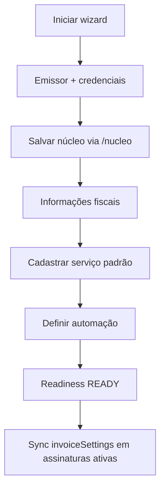
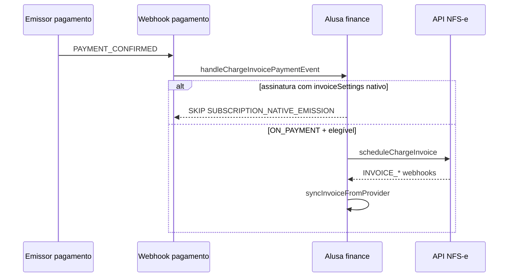

# NFS-e — Configuração fiscal e emissão na Alusa

Documento de referência para **configuração de nota fiscal** e **emissão de NFS-e** vinculada a cobranças. Objetivo: preservar regras de negócio, fronteiras de camada e comportamento esperado ao evoluir o código.

Documentos relacionados:

- [ADR: caminhos de emissão fiscal](./adr-fiscal-emission-paths.md)
- [Runbook: divergência fiscal](./runbooks/fiscal-divergence.md)
- [ADR: fronteiras Asaas](./adr-asaas-layer-boundaries.md)

---

## 1. Visão geral

A Alusa emite **Notas Fiscais de Serviço (NFS-e)** para cobranças educacionais (mensalidades, matrículas, avulsas, parcelamentos e assinaturas) usando integração white label com o emissor fiscal da subconta da escola.

Dois caminhos de automação **mutuamente exclusivos** (ver ADR):

| Origem da cobrança | `emissionMode` | Quem emite |
| --- | --- | --- |
| Cobrança avulsa, parcela, evento, etc. | `ON_PAYMENT` | **Alusa** reage ao webhook de pagamento e chama a API de notas |
| Assinatura acadêmica / standalone com `invoiceSettings` | `ON_PAYMENT` | **Emissor nativo da assinatura**; Alusa espelha webhooks `INVOICE_*` |
| Qualquer origem | `MANUAL` | Usuário emite pela tela da cobrança |

Princípios obrigatórios:

- **Multi-tenant:** toda leitura/escrita filtra por `contaId`.
- **Estado local:** telas leem `Invoice`, `ContaFiscalSettings` e read models persistidos; consulta direta ao emissor é para preflight, sync e correção.
- **Idempotência:** `externalReference` determinístico por cobrança; retries não duplicam nota.
- **Readiness conservador:** conta parcialmente configurada **não** reporta `READY`.
- **Regras no pacote `finance`:** componentes React e route handlers não contêm lógica fiscal crítica.

---

## 2. Estrutura do código

### 2.1 Camadas

```
apps/web/
  app/(app)/admin/configuracoes/notafiscal/page.tsx     # Shell da tela
  app/(app)/financeiro/nota-fiscal/**                   # Consulta por aluno/responsável
  app/api/configuracoes/notafiscal/**                   # APIs de configuração
  app/api/financeiro/nota-fiscal/**                     # APIs do índice financeiro
  app/api/cobrancas/[id]/nota-fiscal/**                 # APIs de emissão/sync/cancel
  app/api/jobs/reconcile-fiscal-settings/route.ts       # Cron config fiscal
  app/api/jobs/reconcile-stale-invoices/route.ts        # Cron notas stale
  features/configuracoes/notafiscal/**                  # Wizard UI + hooks + DTOs
  components/financeiro/CobrancaNotaFiscal.tsx          # Painel na cobrança

packages/finance/src/
  fiscal/                                               # Regras puras (validação, readiness, elegibilidade)
  use-cases/                                            # Casos de uso (emitir, cancelar, salvar, sync)
  webhooks/                                             # payment + invoice handlers
  fiscal-wizard-client.ts                               # Exports seguros para o browser

packages/asaas/                                         # Cliente HTTP e tipos do emissor
packages/database/                                      # Prisma + credenciais
```

### 2.2 Wizard de configuração (5 passos na UI)

| Passo UI | `FiscalWizardStepId` | Conteúdo |
| --- | --- | --- |
| Emissor e acesso | `prefeitura` | Portal Nacional vs municipal, e-mail, credenciais (senha/token/certificado A1) |
| Informações fiscais | `informacoes` | Inscrições, CNAE, RPS, NBS, regime — campos dinâmicos conforme `municipalOptions` |
| Serviço | `servico` | CRUD de `FiscalService`; exige núcleo fiscal salvo antes de listar serviços municipais |
| Automação | `padroes` | Descrição padrão, modo manual/automático, período em assinaturas |
| Revisão | — | Checklist + confirmação final |

Rascunho local: `fiscal-wizard-draft-storage.ts` (sem segredos nem arquivos).

---

## 3. Modelo de dados (Prisma)

### 3.1 `ContaFiscalSettings` (1:1 com `Conta`)

Campos principais:

- **Emissor:** `useNationalPortal`, credenciais (`accessMethod`, flags `*Configured`)
- **Dados fiscais:** inscrições, CNAE, RPS, NBS, regime especial, AEDF, etc.
- **Padrões:** `defaultDescriptionTemplate`, `defaultObservations`, `defaultDeductions`
- **Automação:** `emissionMode`, `invoiceEffectiveDatePeriod`, `invoiceDaysBeforeDueDate`, `invoiceReceivedOnly`
- **Operação:** `readinessStatus`, `readinessIssues`, `syncStatus`, `lastSyncError`, `lastSyncedAt`, `asaasFiscalSyncedAt`

Enum `FiscalInvoiceEffectiveDatePeriod`:

- `ON_PAYMENT_CONFIRMATION` (default)
- `ON_PAYMENT_DUE_DATE`
- `BEFORE_PAYMENT_DUE_DATE`
- `ON_DUE_DATE_MONTH`
- `ON_NEXT_MONTH`

Migration: `20260617003000_fiscal_invoice_settings_period`.

### 3.2 `FiscalService` (N por conta)

Serviço municipal usado na emissão. Um deve ter `isDefault = true` para readiness.

- `source`: `MUNICIPAL_LIST` | `MANUAL`
- Alíquotas: ISS, PIS, COFINS, CSLL, INSS, IR, `retainIss`
- Portal Nacional / reforma: `nationalTaxCode`, `nbsCode`, `pisCofinsTaxStatus`, códigos tributários, `useTaxSystemReformNT007`
- `asaasMunicipalServiceId` quando selecionado da lista do emissor

### 3.3 `Invoice` (1:1 com `Charge`)

Espelho local da NFS-e. Status (`InvoiceStatus`): `SCHEDULED`, `SYNCHRONIZED`, `AUTHORIZED`, `PROCESSING_CANCELLATION`, `CANCELED`, `CANCELLATION_DENIED`, `ERROR`.

Índices tenant-scoped: `@@unique([contaId, externalReference])`, `@@unique([contaId, asaasInvoiceId])`.

### 3.4 `InvoiceAuditEvent`

Trilha de auditoria por nota (`action`, `fromStatus`, `toStatus`, `metadata`, `correlationId`).

---

## 4. Regras de negócio

### 4.1 Readiness (`computeFiscalReadiness`)

Bloqueia emissão quando:

| Código | Condição |
| --- | --- |
| `FEATURE_DISABLED` | Feature flag de notas desligada |
| `KYC_PENDING` | KYC financeiro não aprovado |
| `NOT_CONFIGURED` | Sem `ContaFiscalSettings` |
| `MUNICIPAL_OPTIONS_UNAVAILABLE` | `municipalOptions === null` com config parcial |
| `ACCESS_NOT_CONFIGURED` | Método de acesso não configurado |
| `FISCAL_EMAIL_REQUIRED` | E-mail fiscal vazio |
| `DEFAULT_SERVICE_REQUIRED` | Sem serviço com `isDefault` |
| Campos dinâmicos | `serviceListItem`, `stateInscription`, `aedf`, `specialTaxRegime`, `nbsCode`, etc. conforme `municipalOptions` |
| `MUNICIPAL_INSCRIPTION_REQUIRED` | Inscrição municipal |
| `RPS_SERIE_REQUIRED` / `RPS_NUMBER_REQUIRED` | Série e próximo RPS |

Status resultante: `NOT_CONFIGURED` → `PENDING` → `READY`.

### 4.2 Validação do wizard (`validateFiscalWizardStep`)

- Passo `prefeitura`: credenciais conforme `accessMethod` / `municipalOptions.authenticationType`
- Passo `informacoes`: campos obrigatórios dinâmicos + validação NBS + série RPS (faixas Portal Nacional vs municipal)
- Passo `servico`: serviço padrão cadastrado
- Passo `padroes`: se `BEFORE_PAYMENT_DUE_DATE`, `invoiceDaysBeforeDueDate` ∈ {5, 10, 15, 30, 60}

Validação espelhada no client (`fiscal-wizard-client`) e no server (`packages/finance`).

### 4.3 PIS/COFINS (`pis-cofins-tax-status.ts`)

Centraliza opções oficiais, validação e normalização de alíquotas:

- Obrigatório no Portal Nacional quando **não** Simples Nacional
- Situações tributáveis exigem alíquotas **> 0**
- Situações isentas / alíquota zero exigem **0**
- Alguns status exigem alíquotas **null** no payload ao emissor

Usado em: `manage-fiscal-services`, `schedule-charge-invoice`, `sync-subscription-fiscal-settings`.

### 4.4 Elegibilidade de emissão (`evaluateChargeInvoiceEligibility`)

Define `canEmit`, `canRetry`, `canCancel`, `shouldAutoCancel` e mensagem user-facing.

Regras principais:

- Valor ≤ 0 → não emite
- Sem `asaasPaymentId` → não emite
- Nota ativa (`SCHEDULED`…`AUTHORIZED`) → não emite de novo; cancelável se status permitir
- Pagamento cancelado/estornado/chargeback → não emite; pode auto-cancelar nota existente
- Pagamento confirmado → `canEmit: true`
- Charge `PENDING_SYNC` / `CREATED` → aguardar sync

### 4.5 Automação por webhook (`handleChargeInvoicePaymentEvent`)

Ordem de decisão:

1. Evento sensível (estorno, chargeback, etc.) → tenta **auto-cancel** se nota cancelável; senão `REVIEW_REQUIRED`
2. Evento não é pagamento confirmado → `SKIPPED`
3. `emissionMode !== ON_PAYMENT` → `SKIPPED`
4. Nota já existe (exceto `ERROR`) → `SKIPPED`
5. Assinatura com `asaasInvoiceSettingsConfigured` → `SKIPPED` (`SUBSCRIPTION_NATIVE_EMISSION`) — **evita dupla emissão**
6. Caso contrário → `emitChargeInvoice` (sistema)

### 4.6 Assinaturas (`syncSubscriptionFiscalSettings`)

Quando `emissionMode = ON_PAYMENT` e readiness OK, sincroniza `invoiceSettings` no emissor:

- Serviço padrão (lista ou manual)
- `effectiveDatePeriod`, `daysBeforeDueDate`, `receivedOnly`
- Impostos normalizados (PIS/COFINS)
- Marca `asaasInvoiceSettingsConfigured` na assinatura

### 4.7 Cancelamento (`cancelChargeInvoice`)

- Status canceláveis: `SCHEDULED`, `SYNCHRONIZED`, `AUTHORIZED`
- Consulta `municipalOptions.supportsCancellation`; se `false`, retorna `INVOICE_CANCELAMENTO_NAO_SUPORTADO`
- Exige KYC e feature flag

### 4.8 Data efetiva (`invoice-effective-date.ts`)

`effectiveDate` enviada ao emissor deve ser **≥ data atual** (fuso do emissor).

### 4.9 Descrição da nota (`invoice-description-template.ts`)

Template com variáveis: `{aluno}`, `{responsavel}`, `{competencia}`, `{matricula}`, `{turma}`, `{plano}`, `{contrato}`.

### 4.10 NBS (`nbs-code.ts`)

Formato oficial `N.NNNN.NN.NN` (9 dígitos). Normalização antes de persistir/enviar.

---

## 5. APIs HTTP

Todas exigem sessão autenticada + role (`ADMIN` / `FINANCEIRO`) e `contaId` validado, salvo jobs com cron token.

### 5.1 Configuração (`/api/configuracoes/notafiscal`)

| Rota | Método | Caso de uso |
| --- | --- | --- |
| `/` | GET/PUT | Ler/salvar settings completos |
| `/nucleo` | PUT | Salvar emissor + informações fiscais (passos 1–2) antes de serviços |
| `/sincronizar` | POST | Revalidar configuração com emissor |
| `/municipal-options` | GET | Requisitos dinâmicos da prefeitura |
| `/portal-nacional` | PUT | Toggle Portal Nacional |
| `/servicos` | GET/POST | Listar/criar serviços |
| `/servicos/[id]` | PUT/DELETE | Editar/excluir serviço |
| `/servicos-municipais` | GET | Busca typeahead (exige núcleo salvo) |
| `/nbs-codes` | GET | Busca NBS |
| `/referencias/[kind]` | GET | Códigos federais (situação, classificação, etc.) |

### 5.2 Emissão na cobrança (`/api/cobrancas/[id]/nota-fiscal`)

| Rota | Método | Caso de uso |
| --- | --- | --- |
| `/` | GET | Detalhe + preview + elegibilidade + readiness |
| `/emitir` | POST | Emitir/agendar |
| `/cancelar` | POST | Cancelar |
| `/sincronizar` | POST | Sync status com emissor |

### 5.3 Consulta financeira (`/api/financeiro/nota-fiscal`)

| Rota | Método | Caso de uso |
| --- | --- | --- |
| `/summary` | GET | Índice por aluno, responsável ou Outros |
| `/aluno/[alunoId]` | GET | Detalhe + KPIs + lista de notas do aluno |
| `/responsavel/[responsavelId]` | GET | Detalhe + KPIs + lista (coluna Aluno quando aplicável) |
| `/outros` | GET | Notas sem vínculo de matrícula/responsável |

Telas: `/financeiro/nota-fiscal` (índice), drill-down em `/aluno/[id]`, `/responsavel/[id]` e `/outros`.

### 5.4 Jobs (cron)

| Rota | Função |
| --- | --- |
| `POST /api/jobs/reconcile-fiscal-settings` | Contas `PENDING`/`DIVERGED` |
| `GET/POST /api/jobs/reconcile-stale-invoices` | Notas `SCHEDULED`/`SYNCHRONIZED`/`ERROR` stale (>60 min default) |

Parâmetros úteis: `contaId`, `limit`, `staleOlderThanMinutes`.

---

## 6. UI — componentes principais

| Componente | Responsabilidade |
| --- | --- |
| `FiscalInvoiceSettingsFeature` | Wizard completo, sync status, callouts |
| `FiscalServiceFormDialog` | CRUD serviço + campos avançados Portal Nacional |
| `FiscalCertificateUploadField` | Upload A1 drag-and-drop (.pfx/.p12, máx. 5 MB) |
| `FiscalPisCofinsTaxStatusField` | Dropdown PIS/COFINS |
| `FiscalNbsCodeField` / `FiscalReferenceCodeField` | Busca códigos oficiais |
| `FiscalAnchoredDropdownPanel` | Posicionamento de sugestões (top/bottom) |
| `CobrancaNotaFiscal` | Emissão manual, polling, PDF/XML, cancelamento |

### 6.1 Copy e tooltips

- Tom **Alusa**, sem citar integrações ou termos de API na UI
- Callout roxo (`variant="brand"`) com exemplos práticos por período de assinatura
- Evitar travessão (`—`) solto no meio de frases longas (preferir vírgula)

### 6.2 Regras de hooks React

**Nunca** colocar `useMemo`/`useEffect`/`useState` após early return (ex.: loading). O wizard já corrigiu esse padrão — manter todos os hooks antes de qualquer `return` condicional.

---

## 7. Fluxos ponta a ponta

### 7.1 Configuração inicial



### 7.2 Emissão automática (cobrança avulsa)



### 7.3 Emissão manual

Usuário abre cobrança → `GET nota-fiscal` → dialog com preview → `POST emitir` → polling até `AUTHORIZED` ou `ERROR`.

---

## 8. Testes (regressão)

### 8.1 Unitários (`packages/finance/src/fiscal/__tests__`)

| Arquivo | Cobre |
| --- | --- |
| `fiscal-settings-validation.test.ts` | Wizard, RPS, períodos |
| `fiscal-readiness.test.ts` | Readiness |
| `charge-invoice-eligibility.test.ts` | Elegibilidade |
| `pis-cofins-tax-status.test.ts` | PIS/COFINS |
| `nbs-code.test.ts` | Formato NBS |
| `invoice-effective-date.test.ts` | Data mínima |
| `invoice-description-template.test.ts` | Templates |
| `fiscal-prisma.test.ts` | Cliente fiscal isolado |

### 8.2 Outros

- `handle-charge-invoice-payment-event.test.ts` — skip em assinatura nativa
- `apps/web/app/api/configuracoes/notafiscal/__tests__/route.test.ts`
- `apps/web/app/api/configuracoes/notafiscal/referencias/__tests__/route.test.ts`

### 8.3 Comandos úteis

```bash
# Testes focados
pnpm exec dotenv -e .env.local -- pnpm --filter @alusa/finance exec vitest run \
  src/fiscal/__tests__/fiscal-settings-validation.test.ts \
  src/fiscal/__tests__/pis-cofins-tax-status.test.ts \
  src/fiscal/__tests__/charge-invoice-eligibility.test.ts

# Migration local
pnpm run db:migrate:local
```

---

## 9. Boas práticas e anti-regressão

### 9.1 O que **não** fazer

- Duplicar regra de elegibilidade/readiness/PIS-COFINS em componentes ou routes
- Emitir nota local **e** deixar assinatura com `invoiceSettings` ativo para a mesma cobrança
- Remover filtro `contaId` em queries de `Invoice`, `FiscalService`, `ContaFiscalSettings`
- Expor credenciais, certificado ou API key no client
- Alterar status de `Invoice`/`Charge` manualmente no banco sem auditoria
- Adicionar hooks React após conditional return no wizard
- Relaxar TypeScript/Zod para “fazer build passar” em rotas fiscais

### 9.2 O que **sempre** fazer ao alterar o fluxo

1. Atualizar validação em `packages/finance` (client + server compartilham `fiscal-wizard-client`)
2. Considerar impacto em webhooks (`payment-webhook-handler`, `invoice-webhook-handler`)
3. Rodar testes unitários do domínio fiscal
4. Verificar migration em staging/produção (`prisma migrate deploy`)
5. Atualizar este documento se mudar regra de negócio ou rota pública

### 9.3 Checklist de homologação (~15 min)

- [ ] Wizard completo: municipal **ou** Portal Nacional
- [ ] Upload/substituição certificado A1
- [ ] Serviço da lista municipal + serviço manual (Portal Nacional)
- [ ] Readiness bloqueia emissão até `READY`
- [ ] Emissão manual na cobrança paga → PDF/XML
- [ ] Modo automático em cobrança avulsa → nota após webhook
- [ ] Assinatura com automação → **sem** dupla emissão no webhook de pagamento
- [ ] Cancelamento (ou mensagem de não suportado pelo município)
- [ ] Revalidar configuração + job stale invoices em ambiente de teste

### 9.4 Operação

- Cron: `reconcile-fiscal-settings` e `reconcile-stale-invoices`
- Divergência: seguir [runbook fiscal](./runbooks/fiscal-divergence.md)
- Coluna `invoiceEffectiveDatePeriod` exige migration `20260617003000_fiscal_invoice_settings_period`

---

## 10. Mapa de casos de uso (`packages/finance`)

| Caso de uso | Arquivo |
| --- | --- |
| `getFiscalInvoiceSettings` | Leitura settings + readiness + municipalOptions |
| `saveFiscalCoreSettings` | Núcleo fiscal (emissor + info) |
| `saveFiscalInvoiceSettings` | Settings completos + padrões |
| `manageFiscalServices` | CRUD serviços |
| `syncSubscriptionFiscalSettings` | invoiceSettings por assinatura |
| `scheduleChargeInvoice` | Agenda/emite via API |
| `emitChargeInvoice` | Orquestra emissão + preview |
| `getChargeInvoiceDetail` | Detalhe para UI |
| `cancelChargeInvoice` | Cancelamento |
| `syncInvoiceFromProvider` | Pull status do emissor |
| `reconcileStaleInvoices` | Job notas antigas |
| `handleChargeInvoicePaymentEvent` | Automação pós-pagamento |
| `handleInvoiceWebhook` | Espelha eventos `INVOICE_*` |

---

## 11. Histórico de entrega (escopo concluído)

Feature considerada **concluída** para produção quando:

- Wizard de configuração com UX Alusa (tooltips, callouts, certificado drag-and-drop, exemplos por período)
- Validação PIS/COFINS alinhada ao Portal Nacional
- Automação dual-path (Alusa vs assinatura nativa) sem duplicidade
- Readiness, elegibilidade, cancelamento condicional, auditoria
- Jobs de reconciliação e testes unitários de domínio
- Migration de período de emissão aplicada em todos os ambientes

---

*Última revisão: junho/2026 — manter atualizado ao alterar regras fiscais ou contratos de API.*
