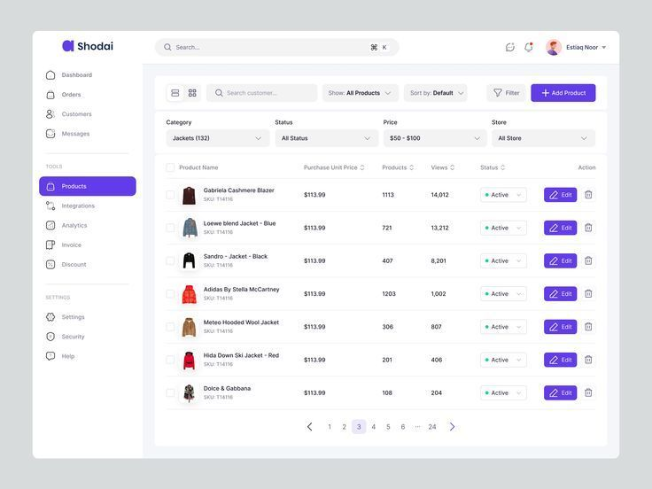

# Feature Loja — Plano de Implementação (MVP)

## Sumário

- [1. Diagnóstico do Sistema Atual](#1-diagnóstico-do-sistema-atual)
- [2. Mapa de Telas](#2-mapa-de-telas)
- [3. Mapa de Componentes](#3-mapa-de-componentes)
- [4. Mapa de Fluxos](#4-mapa-de-fluxos)
- [5. Regras de Negócio](#5-regras-de-negócio)
- [6. Plano Técnico](#6-plano-técnico)
- [7. Plano em Fases](#7-plano-em-fases)
- [8. Riscos e Mitigações](#8-riscos-e-mitigações)

---

## 1. Diagnóstico do Sistema Atual

### 1.1. Arquitetura Geral

O projeto é um **monorepo pnpm** com:

| Camada | Local | Função |
|---|---|---|
| **App (Next.js)** | `apps/web/` | Pages, API routes, componentes, hooks |
| **Finance** | `packages/finance/` | Use cases, services, mappers, webhooks |
| **Asaas Client** | `packages/asaas/` | SDK tipado para API Asaas |
| **Asaas Gateway** | `packages/asaas-gateway/` | Middleware de integração, external-reference, feature flags |
| **Domain** | `packages/domain/` | Regras de negócio e validações |
| **Database** | `packages/database/` | Prisma utilities |
| **Shared** | `packages/shared/` | Tipos e constantes compartilhadas |
| **UI** | `packages/ui/` | DataTable, column helpers, primitivas |

**Padrão de organização de features em `apps/web/`:**

```
app/(app)/[feature]/page.tsx        → Rota/página
features/[feature]/                 → Componentes, DTOs, mappers da feature
components/[feature]/               → Componentes compartilhados da feature
hooks/                              → Hooks reutilizáveis
lib/                                → Utils, stores, formatters
app/api/[feature]/route.ts          → API routes
```

### 1.2. Sidebar Existente — Grupo "Loja" já cadastrado

O sidebar **já possui** um grupo `loja` marcado como `comingSoon: true`:

```typescript
{
  key: 'loja',
  label: 'Loja',
  icon: <ShoppingBagIcon />,
  comingSoon: true,
  items: [
    { label: 'Produtos', href: '/loja/produtos' },
    { label: 'Pedidos',  href: '/loja/pedidos' },
    { label: 'Estoque',  href: '/loja/estoque' },
  ],
}
```

**Decisão para o MVP:** Ajustar o grupo para:

```typescript
{
  key: 'vendas',
  label: 'Vendas',
  icon: <ShoppingBagIcon />,
  comingSoon: false,
  items: [
    { label: 'Nova Venda', href: '/vendas/nova' },
    { label: 'Produtos',   href: '/vendas/produtos' },
    { label: 'Histórico',  href: '/vendas/historico' },
  ],
}
```

**Justificativa:** O PRD define "Vendas" como label do sidebar, com subitens "Nova venda", "Produtos" e "Histórico". "Estoque" fica dentro de Produtos, não como item separado.

**Permissões:** Adicionar `{ key: 'vendas' }` nos roles `ADMIN` e `RECEPCAO` (operadora principal de vendas). Opcionalmente `FINANCEIRO` para consulta de histórico.

### 1.3. Entidades Acadêmicas e Financeiras Existentes

#### Aluno → Responsável → Customer

| Entidade | Tabela | Papel |
|---|---|---|
| **Aluno** | `Aluno` | Estudante. Pode ser pagador se maior de idade. |
| **Responsável** | `Responsavel` | Pagador financeiro. Possui `asaasCustomerId`. |
| **AlunoResponsavel** | `AlunoResponsavel` | Vínculo N:N aluno↔responsável |
| **Customer** | `Customer` | Registro local do cliente Asaas (`payerType` + `payerId` + `asaasCustomerId`) |

**Invariante:** Aluno menor de idade **nunca** é Customer no Asaas. O pagador é sempre o `Responsavel`.

**Resolução de pagador:** `packages/finance/src/services/resolve-payer.service.ts`
- `resolvePayerFromAluno()` → se menor, retorna responsável; se maior, retorna aluno.
- Retorna `{ payerType, payerId, asaasCustomerId }`.

#### Cobranças e Charges

| Entidade | Tabela | Papel |
|---|---|---|
| **Cobranca** (legacy) | `Cobranca` | Cobrança vinculada a matrícula (TAXA, MENSALIDADE, AVULSA, etc.) |
| **Charge** (read-model) | `Charge` | Charge moderna — suporta standalone (sem matrícula) |
| **StandaloneInstallmentPlan** | `StandaloneInstallmentPlan` | Parcelamento avulso |
| **StandaloneSubscription** | `StandaloneSubscription` | Assinatura avulsa |
| **ChargeReadModel** | `ChargeReadModel` | Projeção unificada para listagem |

**Constatação crítica:** O modelo `Charge` **já suporta cobranças avulsas** (standalone), desvinculadas de matrícula. Isso é exatamente o que a Loja precisa para "Gerar cobrança".

#### Integração Asaas

| Componente | Local | Papel |
|---|---|---|
| **Asaas Client** | `packages/asaas/` | SDK com módulos: payments, customers, subscriptions, installments, pix, etc. |
| **Asaas Gateway** | `packages/asaas-gateway/` | Feature flags, external references, webhook utilities |
| **Webhook Route** | `apps/web/app/api/webhooks/asaas/route.ts` | Receptor de webhooks com idempotência |
| **Webhook Handler** | `packages/finance/src/webhooks/` | Processamento por tipo de evento |
| **Status Mapper** | `apps/web/lib/asaas-status-mapper.ts` | Asaas status → StatusCobranca / ChargeStatus |
| **Sync Service** | `packages/finance/src/services/asaas-sync.service.ts` | Sincronização read-only + controlled writes |
| **Feature Flags** | `packages/finance/src/foundation/feature-flags.service.ts` | Controle de features por conta |
| **Audit Log** | `packages/finance/src/foundation/audit-log.service.ts` | Triple-log (AuditLog + LogIntegracao + LogFinanceiro) |

**Constatação:** A infraestrutura financeira e de integração com Asaas está **completa e madura**. A Loja deve se plugar nela, não duplicá-la.

### 1.4. Serviços Financeiros Reaproveitáveis

| Serviço | Local | O que faz | Reuso na Loja |
|---|---|---|---|
| `createStandaloneCharge` | `packages/finance/src/use-cases/` | Cria cobrança avulsa (ONE_TIME, INSTALLMENT, SUBSCRIPTION) no Asaas | **Direto** — "Gerar cobrança" na venda |
| `resolvePayerFromAluno` | `packages/finance/src/services/` | Resolve pagador (aluno menor → responsável) | **Direto** — resolver pagador na venda |
| `listCharges` | `packages/finance/src/use-cases/` | Lista charges por conta | **Direto** — vincular venda ↔ cobrança |
| `getBalance` | `packages/finance/src/use-cases/` | Consulta saldo Asaas | Não necessário no MVP |
| Webhook handlers | `packages/finance/src/webhooks/` | Processa eventos de pagamento | **Direto** — atualizar status de vendas com cobrança |
| Audit log | `packages/finance/src/foundation/` | Registro de auditoria | **Direto** — auditar vendas |

### 1.5. Componentes UI Reaproveitáveis

| Componente | Local | Reuso na Loja |
|---|---|---|
| `DataTable` | `apps/web/components/layout/DataTable.tsx` | **Direto** — listagem de produtos e histórico |
| `statusColumn` / `actionsColumn` | `packages/ui/src/datatable/columns.tsx` | **Direto** — colunas de status e ações |
| `EntityFiltersBar` | `apps/web/components/layout/EntityFiltersBar.tsx` | **Direto** — filtros em listagens |
| `QuickFilterTabs` | `apps/web/components/layout/QuickFilterTabs.tsx` | **Direto** — filtros rápidos por status |
| `Pagination` | `apps/web/components/layout/Pagination.tsx` | **Direto** — paginação |
| `CardHeader` | `apps/web/components/layout/CardHeader.tsx` | **Direto** — header de páginas |
| `TableLayout` | `apps/web/components/layout/TableLayout.tsx` | **Direto** — wrapper de tabelas |
| `PayerSearchInput` | `apps/web/components/financeiro/PayerSearchInput.tsx` | **Direto** — busca de aluno/responsável na venda |
| `usePayerSearch` | `apps/web/hooks/usePayerSearch.ts` | **Direto** — hook de busca de pagador |
| `CreateChargeModal` | `apps/web/components/financeiro/CreateChargeModal.tsx` | **Referência** — fluxo de criação de cobrança (não usar direto; extrair lógica) |
| `ConfirmDialog` | `apps/web/components/ui/confirm-dialog.tsx` | **Direto** — confirmações destrutivas |
| `Dialog` / `Sheet` | `apps/web/components/ui/dialog.tsx`, `sheet.tsx` | **Direto** — modais e drawers |
| `Badge` | `apps/web/components/ui/badge.tsx` | **Direto** — badges de status |
| `Skeleton` | `apps/web/components/ui/skeleton.tsx` | **Direto** — loading states |
| `Sonner` / Toast | `apps/web/components/ui/sonner.tsx` | **Direto** — feedbacks de sucesso/erro |
| `Input`, `Select`, `Button` | `apps/web/components/ui/` | **Direto** — formulários |
| `DatePicker` | `apps/web/components/ui/date-picker.tsx` | **Direto** — seleção de datas |
| `useDeleteDialog` | `apps/web/hooks/use-delete-dialog.ts` | **Direto** — confirmação de exclusão |
| `useEditDialog` | `apps/web/hooks/use-edit-dialog.ts` | **Direto** — controle de edição |
| `useEntityListFiltering` | `apps/web/hooks/entity/use-entity-list-filtering.ts` | **Direto** — filtros em listagens |

### 1.6. Utilities Reaproveitáveis

| Utility | Local | Reuso |
|---|---|---|
| `formatBRLInput` | `apps/web/lib/finance-form-utils.ts` | **Direto** — input monetário (preço, troco) |
| `parseNumber` | `apps/web/lib/finance-form-utils.ts` | **Direto** — parse de valores monetários |
| `formatPercentInput` | `apps/web/lib/finance-form-utils.ts` | **Direto** — input de desconto % |
| `controlClass`, `labelClass`, `sectionClass` | `apps/web/lib/finance-form-utils.ts` | **Direto** — CSS classes de formulários |
| `buildFinancialRulesPayload` | `apps/web/lib/finance-form-utils.ts` | Parcial — se juros/multa se aplicar |
| `cn()` (classnames) | `apps/web/lib/cn.ts` | **Direto** — merge de classes |
| `formatters` | `apps/web/lib/formatters.ts` | **Direto** — formatação de datas, CPF, etc. |
| User Store | `apps/web/lib/stores/user-store.ts` | **Direto** — dados do usuário logado |

### 1.7. Padrões de Auditoria e Persistência

| Padrão | Implementação | Reuso |
|---|---|---|
| **Triple-log** | AuditLog + LogIntegracao + LogFinanceiro | Usar `AuditLog` para ações de venda |
| **Idempotência** | `eventId` + `payloadHash` em webhooks; `uiRequestId` em charges | Adotar `uiRequestId` para vendas |
| **Soft delete** | `archivedAt` (notificações), `deletedAt` (conta) | Usar `archivedAt` para produtos |
| **Role check** | Sidebar PERMISSIONS + middleware.ts | Estender para `vendas` |

### 1.8. Upload / Imagem

O projeto **não possui** componente de upload genérico no UI. Uploads existem apenas via API routes (KYC docs, foto de colaborador em base64). Para o MVP, imagem de produto é **opcional e não obrigatória**. Se implementada, usar base64 inline como padrão existente (foto colaborador).

---

## 2. Mapa de Telas

### 2.1. Nova Venda (`/vendas/nova`)

**Layout:** Página única (não wizard), duas colunas em desktop.

```
┌──────────────────────────────────────────────────────────────┐
│ CardHeader: "Nova Venda"                                     │
├────────────────────────────┬─────────────────────────────────┤
│                            │                                 │
│  CLIENTE                   │  CARRINHO                       │
│  ┌──────────────────────┐  │  ┌───────────────────────────┐  │
│  │ (•) Aluno/Responsável│  │  │ Item  Qtd  Unit.  Subtot. │  │
│  │ ( ) Cliente avulso   │  │  │ ─────────────────────────│  │
│  └──────────────────────┘  │  │ Collant  2  R$ 45  R$ 90  │  │
│  [PayerSearchInput]        │  │ Meia     1  R$ 15  R$ 15  │  │
│  — ou —                    │  │                           │  │
│  Nome: ______              │  │ Subtotal        R$ 105,00 │  │
│  Telefone: ____            │  │ Desconto         R$ 5,00  │  │
│                            │  │ Total           R$ 100,00 │  │
│  PRODUTOS                  │  └───────────────────────────┘  │
│  [Buscar produto...]       │                                 │
│  ┌──────────────────────┐  │  COMO DESEJA FINALIZAR?         │
│  │ Collant    R$ 45  [+]│  │  ┌───────────────────────────┐  │
│  │ Sapatilha  R$ 80  [+]│  │  │ (•) Receber agora         │  │
│  │ Meia       R$ 15  [+]│  │  │ ( ) Gerar cobrança        │  │
│  │ Uniforme   R$ 60  [+]│  │  │ ( ) Adicionar mensalidade  │  │
│  └──────────────────────┘  │  └───────────────────────────┘  │
│                            │                                 │
│                            │  FORMA DE RECEBIMENTO            │
│                            │  ┌───────────────────────────┐  │
│                            │  │ (•) Dinheiro               │  │
│                            │  │ ( ) Pix                    │  │
│                            │  │ ( ) Cartão débito          │  │
│                            │  │ ( ) Cartão crédito         │  │
│                            │  └───────────────────────────┘  │
│                            │                                 │
│                            │  Valor recebido: R$ ______      │
│                            │  Troco: R$ 0,00                 │
│                            │                                 │
│                            │  [ Finalizar Venda ]            │
└────────────────────────────┴─────────────────────────────────┘
```

**Responsividade:** Em mobile, empilhar verticalmente: cliente → produtos → carrinho → finalização.

### 2.2. Produtos (`/vendas/produtos`)

**Layout:** Padrão de listagem da Alusa (CardHeader + DataTable).

```
┌──────────────────────────────────────────────────────────────┐
│ CardHeader: "Produtos"                     [+ Novo Produto]  │
├──────────────────────────────────────────────────────────────┤
│ [Buscar por nome ou código...]  [Filtro: Estoque ▼]          │
├──────────────────────────────────────────────────────────────┤
│ Produto     │ Categoria │ Preço    │ Estoque │ Status │ Ações│
│─────────────┼───────────┼──────────┼─────────┼────────┼──────│
│ Collant     │ Uniforme  │ R$ 45,00 │ 23      │ ✓ OK   │ ⋯   │
│ Sapatilha M │ Calçados  │ R$ 80,00 │ 3       │ ⚠ Baixo│ ⋯   │
│ Uniforme PP │ Uniforme  │ R$ 60,00 │ 0       │ ✗ Sem  │ ⋯   │
├──────────────────────────────────────────────────────────────┤
│                         Paginação                            │
└──────────────────────────────────────────────────────────────┘
```

**Empty state:** "Nenhum produto cadastrado. Cadastre seu primeiro produto para começar a vender."

### 2.3. Cadastro / Edição de Produto (Sheet/Drawer)

**Layout:** Sheet lateral (drawer) — padrão já usado em outras features.

```
┌─────────────────────────────┐
│ Novo Produto           [X]  │
├─────────────────────────────┤
│ Nome *                      │
│ [________________________]  │
│                             │
│ Categoria                   │
│ [Uniforme           ▼]     │
│ — ou [+ Criar categoria]   │
│                             │
│ Preço *                     │
│ [R$ 0,00]                  │
│                             │
│ Quantidade em Estoque *     │
│ [0]                         │
│                             │
│ Alerta de estoque baixo     │
│ [5]                         │
│                             │
│ Código / SKU (opcional)     │
│ [________________________]  │
│                             │
│ Descrição (opcional)        │
│ [________________________]  │
│                             │
│ [Cancelar]  [Salvar]        │
└─────────────────────────────┘
```

### 2.4. Histórico (`/vendas/historico`)

**Layout:** Padrão de listagem.

```
┌──────────────────────────────────────────────────────────────┐
│ CardHeader: "Histórico de Vendas"                            │
├──────────────────────────────────────────────────────────────┤
│ [Buscar cliente ou nº venda...]  [Data ▼] [Status ▼]        │
├──────────────────────────────────────────────────────────────┤
│ Nº    │ Data       │ Cliente      │ Total    │ Forma   │ St │
│───────┼────────────┼──────────────┼──────────┼─────────┼────│
│ #0042 │ 01/04/2026 │ Maria Silva  │ R$ 90,00 │ Dinheiro│ ✓  │
│ #0041 │ 31/03/2026 │ João (avulso)│ R$ 45,00 │ Cobrança│ ⏳ │
│ #0040 │ 30/03/2026 │ Ana Souza    │ R$ 60,00 │ Mensal. │ 📎 │
├──────────────────────────────────────────────────────────────┤
│                         Paginação                            │
└──────────────────────────────────────────────────────────────┘
```

### 2.5. Detalhe da Venda (Sheet/Drawer)

```
┌─────────────────────────────┐
│ Venda #0042            [X]  │
├─────────────────────────────┤
│ Cliente: Maria Silva        │
│ Tipo: Aluno                 │
│ Data: 01/04/2026 14:32      │
│ Operador: Recepcionista Ana │
│                             │
│ ITENS                       │
│ ┌─────────────────────────┐ │
│ │ Collant    2x  R$ 90,00 │ │
│ │ Meia       1x  R$ 15,00 │ │
│ └─────────────────────────┘ │
│                             │
│ Subtotal:      R$ 105,00    │
│ Desconto:       -R$ 5,00    │
│ Total:         R$ 100,00    │
│                             │
│ Finalização: Receber agora  │
│ Forma: Dinheiro             │
│ Valor recebido: R$ 110,00   │
│ Troco: R$ 10,00             │
│                             │
│ ─── Cobrança vinculada ──── │
│ (se aplicável)              │
│ ID: pay_xxxx                │
│ Status: Pago                │
│                             │
│ [Cancelar venda]            │
└─────────────────────────────┘
```

---

## 3. Mapa de Componentes

### 3.1. Reaproveitar (usar diretamente)

| Componente | Local | Uso na Loja |
|---|---|---|
| `DataTable` | `components/layout/DataTable.tsx` | Listagem de produtos e histórico |
| `statusColumn` | `packages/ui/src/datatable/columns.tsx` | Coluna de status de estoque |
| `actionsColumn` | `packages/ui/src/datatable/columns.tsx` | Coluna de ações (editar/excluir) |
| `CardHeader` | `components/layout/CardHeader.tsx` | Header de todas as páginas |
| `TableLayout` | `components/layout/TableLayout.tsx` | Wrapper de listagens |
| `EntityFiltersBar` | `components/layout/EntityFiltersBar.tsx` | Filtros em listagens |
| `QuickFilterTabs` | `components/layout/QuickFilterTabs.tsx` | Filtros rápidos (status estoque) |
| `Pagination` | `components/layout/Pagination.tsx` | Paginação |
| `PayerSearchInput` | `components/financeiro/PayerSearchInput.tsx` | Busca aluno/responsável na venda |
| `usePayerSearch` | `hooks/usePayerSearch.ts` | Hook de busca de pagador |
| `useDeleteDialog` | `hooks/use-delete-dialog.ts` | Confirmar exclusão de produto |
| `useEditDialog` | `hooks/use-edit-dialog.ts` | Controlar edição de produto |
| `useEntityListFiltering` | `hooks/entity/use-entity-list-filtering.ts` | Filtragem em listagens |
| `Dialog` | `components/ui/dialog.tsx` | Modais |
| `Sheet` | `components/ui/sheet.tsx` | Drawers (cadastro de produto, detalhe de venda) |
| `ConfirmDialog` | `components/ui/confirm-dialog.tsx` | Confirmações destrutivas |
| `Badge` | `components/ui/badge.tsx` | Status de estoque, status de venda |
| `Skeleton` | `components/ui/skeleton.tsx` | Loading states |
| `Sonner` | `components/ui/sonner.tsx` | Toasts |
| `Input`, `Select`, `Button`, etc. | `components/ui/` | Formulários |
| `DatePicker` | `components/ui/date-picker.tsx` | Filtro de data no histórico |
| `formatBRLInput` / `parseNumber` | `lib/finance-form-utils.ts` | Input monetário |
| `cn()` | `lib/cn.ts` | Merge de classes |
| `formatters` | `lib/formatters.ts` | Formatação de datas, CPF |
| User Store | `lib/stores/user-store.ts` | Dados do usuário (operador de venda) |
| `resolvePayerFromAluno` | `packages/finance/src/services/` | Resolver pagador na venda |
| `createStandaloneCharge` | `packages/finance/src/use-cases/` | Gerar cobrança a partir de venda |
| Status mappers | `lib/asaas-status-mapper.ts` | Mapear status de cobrança vinculada |
| Audit log service | `packages/finance/src/foundation/` | Auditar ações de venda |
| Webhook handlers | `packages/finance/src/webhooks/` | Atualizar status de vendas via webhook |

### 3.2. Adaptar / Estender

| Componente | Adaptação necessária |
|---|---|
| **PayerSearchInput** | Funciona direto para aluno/responsável. Para cliente avulso, criar input inline separado (não é extensão deste componente). |
| **Sidebar GROUPS** | Substituir grupo `loja` por `vendas` com novos subitens e remover `comingSoon`. |
| **Sidebar PERMISSIONS** | Adicionar `{ key: 'vendas' }` nos roles ADMIN e RECEPCAO. |
| **Webhook payment handler** | Estender para, ao confirmar pagamento de charge vinculada a venda, atualizar status da venda. |

### 3.3. Criar (componentes novos)

| Componente | Descrição |
|---|---|
| **SaleClientSelector** | Toggle aluno/responsável vs. cliente avulso + inputs para avulso (nome, telefone, obs) |
| **ProductSearchList** | Lista de produtos com busca, exibição de estoque e botão de adicionar ao carrinho |
| **SaleCart** | Carrinho com itens, quantidades, remoção, subtotal, desconto, total |
| **SaleFinalizationPanel** | Painel de finalização: tipo (receber agora / gerar cobrança / adicionar mensalidade) + forma de recebimento |
| **CashPaymentBlock** | Bloco de pagamento em dinheiro: valor recebido, troco calculado |
| **ProductForm** | Formulário de cadastro/edição de produto (nome, categoria, preço, estoque, limiar, SKU, descrição) |
| **CategoryInlineSelect** | Select de categoria com opção de criar nova inline |
| **StockBadge** | Badge de status de estoque (Disponível / Estoque baixo / Sem estoque) |
| **SaleDetailSheet** | Sheet de detalhe de venda com itens, totais, forma de finalização, vínculo financeiro |
| **SaleStatusBadge** | Badge de status de venda (Concluída / Pendente / Cancelada) |

---

## 4. Mapa de Fluxos

### 4.1. Venda com Aluno/Responsável — Receber agora

```
Recepcionista abre /vendas/nova
  → seleciona "Aluno/Responsável"
  → busca aluno via PayerSearchInput
  → sistema resolve pagador (se menor → responsável)
  → adiciona produtos ao carrinho
  → ajusta quantidades (respeitando estoque)
  → opcionalmente aplica desconto
  → seleciona "Receber agora"
  → escolhe forma: Dinheiro / Pix / Cartão
  → (se dinheiro) informa valor recebido → sistema calcula troco
  → clica "Finalizar Venda"
  → sistema:
     1. Valida estoque final (recheck)
     2. Cria registro Sale + SaleItems
     3. Cria registro SalePayment (forma, valor, troco)
     4. Baixa estoque dos produtos
     5. Marca venda como CONCLUIDA
     6. Registra AuditLog (action: CREATE_SALE, actor: USER)
     7. Exibe toast "Venda finalizada com sucesso"
```

### 4.2. Venda com Cliente Avulso — Receber agora

```
Recepcionista abre /vendas/nova
  → seleciona "Cliente avulso"
  → preenche nome (obrigatório) e telefone (opcional)
  → adiciona produtos ao carrinho
  → seleciona "Receber agora"
  → escolhe forma de recebimento
  → finaliza
  → sistema:
     1–7 igual ao fluxo 4.1
     Diferenças:
     - SaleCustomer criado como avulso (sem vínculo acadêmico)
     - Opção "Adicionar na mensalidade" OCULTA
```

### 4.3. Venda com Aluno/Responsável — Gerar Cobrança

```
Recepcionista abre /vendas/nova
  → seleciona aluno/responsável
  → adiciona produtos
  → seleciona "Gerar cobrança"
  → sistema exibe opções de cobrança:
     - Forma: Pix / Boleto / Cartão / Cliente escolhe
     - Vencimento (DatePicker)
  → clica "Finalizar Venda"
  → sistema:
     1. Valida estoque final
     2. Resolve pagador via resolvePayerFromAluno()
     3. Verifica se pagador tem asaasCustomerId (se não, cria Customer no Asaas)
     4. Chama createStandaloneCharge() com:
        - payer resolvido
        - chargeType: ONE_TIME
        - billingType: selecionado
        - value: total da venda
        - dueDate: data informada
        - description: "Venda #XXXX — [itens resumidos]"
        - uiRequestId: UUID (idempotência)
     5. Cria registro Sale + SaleItems
     6. Vincula Sale → Charge (chargeId)
     7. Baixa estoque
     8. Marca venda como PENDENTE (aguardando pagamento)
     9. AuditLog + LogIntegracao
     10. Toast "Cobrança gerada com sucesso"
  → Quando webhook PAYMENT_RECEIVED chegar:
     - Webhook handler já existente atualiza Charge.status
     - Loja verifica se Charge está vinculada a Sale → atualiza Sale.status para CONCLUIDA
```

### 4.4. Venda com Aluno/Responsável — Adicionar na Mensalidade

```
Recepcionista abre /vendas/nova
  → seleciona aluno/responsável
  → adiciona produtos
  → seleciona "Adicionar na mensalidade"
  → sistema valida:
     - aluno possui matrícula ativa?
     - matrícula possui assinatura/recorrência ativa?
  → se válido, exibe resumo: "O valor de R$ XX será incluído na próxima mensalidade de [aluno]"
  → clica "Finalizar Venda"
  → sistema:
     1. Valida estoque final
     2. Cria registro Sale + SaleItems
     3. Vincula Sale à matrícula ativa do aluno
     4. Marca venda como VINCULADA_MENSALIDADE
     5. Baixa estoque
     6. AuditLog
     7. O valor é registrado para inclusão no próximo ciclo de cobrança recorrente

  NOTA: A implementação exata depende de como o sistema atual compõe mensalidades.
  Duas abordagens possíveis:
  a) Criar cobrança avulsa (EXTRA) vinculada à matrícula com mesmo vencimento da próxima mensalidade
  b) Acumular valor em campo da matrícula/assinatura para incluir no próximo ciclo

  A abordagem (a) é mais simples e rastreável — usar createStandaloneCharge com
  dueDate = próximo vencimento da assinatura, description referenciando a venda.
```

### 4.5. Cadastro de Produto

```
Recepcionista acessa /vendas/produtos
  → clica "Novo Produto"
  → abre Sheet lateral com ProductForm
  → preenche campos:
     - Nome (obrigatório)
     - Categoria (select com inline create)
     - Preço (input monetário, obrigatório)
     - Quantidade em estoque (número, obrigatório, ≥ 0)
     - Alerta de estoque baixo (número, default 5)
     - Código/SKU (opcional)
     - Descrição (opcional)
  → clica "Salvar"
  → sistema:
     1. Valida via schema Zod
     2. POST /api/vendas/produtos
     3. Persiste Product
     4. Fecha sheet
     5. Atualiza listagem
     6. Toast "Produto cadastrado"
```

### 4.6. Edição de Produto

```
Recepcionista clica "Editar" na listagem de produtos
  → abre Sheet com ProductForm preenchido
  → edita campos
  → clica "Salvar"
  → sistema:
     1. Valida
     2. PUT /api/vendas/produtos/[id]
     3. Atualiza Product
     4. Fecha sheet
     5. Atualiza listagem
     6. Toast "Produto atualizado"
```

### 4.7. Exclusão / Arquivamento de Produto

```
Recepcionista clica "Excluir" na listagem
  → ConfirmDialog: "Tem certeza que deseja arquivar este produto?"
  → confirma
  → sistema:
     1. Verifica se produto tem vendas vinculadas
     2. Se sim → soft delete (archivedAt = now())
     3. Se não → hard delete
     4. Atualiza listagem
     5. Toast "Produto arquivado/removido"
```

---

## 5. Regras de Negócio

### 5.1. Estoque

| Regra | Descrição |
|---|---|
| Baixa automática | Ao finalizar venda, reduzir estoque de cada item pela quantidade vendida |
| Venda sem estoque | Bloqueada — produto com estoque 0 não pode ser adicionado ao carrinho |
| Quantidade máxima | Não permitir quantidade no carrinho > estoque disponível |
| Estoque negativo | Proibido em qualquer cenário |
| Alerta estoque baixo | Se `quantidade ≤ limiar`, exibir badge "Estoque baixo" |
| Sem estoque | Se `quantidade = 0`, exibir badge "Sem estoque" e desabilitar botão de adicionar |
| Revalidação | Ao clicar "Finalizar Venda", revalidar estoque antes de persistir (proteção contra concorrência) |
| Ajuste manual | Permitido na edição do produto via campo de quantidade |

### 5.2. Cliente

| Regra | Descrição |
|---|---|
| Aluno/Responsável | Busca via `PayerSearchInput` existente. O sistema resolve o pagador correto. |
| Cliente avulso | Requer nome (obrigatório). Telefone e observação são opcionais. |
| Avulso → sem mensalidade | Cliente avulso **não pode** usar "Adicionar na mensalidade" |
| Avulso → cobrança limitada | Cliente avulso pode receber cobrança **apenas se** o sistema criar Customer avulso no Asaas (name + cpfCnpj mínimo) — avaliar viabilidade no MVP. Alternativa: avulso só permite "Receber agora". |

### 5.3. Formas de Recebimento Presencial

| Forma | Regras |
|---|---|
| Dinheiro | Exibir total, campo "valor recebido", campo calculado "troco". Bloquear finalização se valor recebido < total. |
| Pix presencial | Marcação manual — recepcionista confirma que recebeu via app externo. |
| Cartão débito | Marcação manual — recepcionista confirma maquininha externa. |
| Cartão crédito | Marcação manual. No MVP, parcelas são informativas (campo "em X vezes") sem criar split no Asaas. |

### 5.4. Geração de Cobrança

| Regra | Descrição |
|---|---|
| Reuso de serviço | Usar `createStandaloneCharge` do `packages/finance` |
| Customer existente | Reaproveitar Customer se já existir (`@@unique([contaId, payerType, payerId])`) |
| Read-before-write | O serviço já implementa verificação de Customer existente |
| Idempotência | `uiRequestId` já implementado no fluxo de standalone charge |
| Formas disponíveis | PIX, BOLETO, CREDIT_CARD, UNDEFINED (cliente escolhe) |
| Status | Venda fica como PENDENTE até webhook confirmar pagamento |
| Rastreabilidade | `Sale.chargeId` referencia `Charge.id`, que referencia `asaasPaymentId` |

### 5.5. Adicionar na Mensalidade

| Regra | Descrição |
|---|---|
| Elegibilidade | Apenas aluno com matrícula ATIVA que possua cobrança recorrente |
| Indisponível para avulso | Opção oculta se cliente for avulso |
| Implementação MVP | Criar cobrança avulsa (tipo EXTRA) vinculada à matrícula com vencimento = próxima mensalidade |
| Rastreabilidade | A cobrança gerada referencia a venda na description e metadata |

### 5.6. Desconto

| Regra | Descrição |
|---|---|
| Tipo | Valor fixo (R$) no MVP. Percentual como extensão futura. |
| Aplicação | Sobre o total da venda, não por item |
| Limites | Desconto não pode exceder o total da venda |
| Registro | Persistido no registro de venda para auditoria |

### 5.7. Exclusão / Arquivamento de Produto

| Regra | Descrição |
|---|---|
| Sem vendas | Hard delete permitido |
| Com vendas | Soft delete via `archivedAt` — produto fica invisível na busca de venda, mas o histórico preserva dados |
| Reativação | Permitida — limpar `archivedAt` |

### 5.8. Cancelamento de Venda

| Regra | Descrição |
|---|---|
| Recebimento presencial | Permite cancelar — estoque retorna, marca venda como CANCELADA |
| Cobrança gerada | Cancelar venda + cancelar cobrança no Asaas (se ainda PENDING). Se já PAID, necessário estorno — fora do MVP. |
| Mensalidade vinculada | Cancelar venda + cancelar cobrança extra vinculada. Se já processada, não cancelar. |
| Confirmação | Sempre exigir ConfirmDialog |
| Auditoria | Registrar motivo e operador |

---

## 6. Plano Técnico

### 6.1. Modelagem de Dados (Prisma)

```prisma
// ─── Enums ───

enum SaleStatus {
  CONCLUIDA           // Recebimento presencial confirmado
  PENDENTE            // Cobrança gerada, aguardando pagamento
  VINCULADA_MENSALIDADE  // Vinculada ao ciclo de mensalidade
  CANCELADA
}

enum SaleFinalizationType {
  RECEBIMENTO_PRESENCIAL
  COBRANCA
  MENSALIDADE
}

enum SalePaymentMethod {
  DINHEIRO
  PIX_PRESENCIAL
  CARTAO_DEBITO
  CARTAO_CREDITO
}

// ─── Models ───

model ProductCategory {
  id      String @id @default(cuid())
  contaId String
  name    String

  createdAt DateTime @default(now())
  updatedAt DateTime @updatedAt

  conta    Conta     @relation(fields: [contaId], references: [id], onDelete: Cascade)
  products Product[]

  @@unique([contaId, name])
  @@index([contaId])
}

model Product {
  id      String @id @default(cuid())
  contaId String

  name        String
  description String?
  sku         String?
  price       Decimal   @db.Decimal(12, 2)
  stock       Int       @default(0)
  lowStockThreshold Int @default(5)
  categoryId  String?

  archivedAt DateTime?

  createdAt DateTime @default(now())
  updatedAt DateTime @updatedAt

  conta    Conta            @relation(fields: [contaId], references: [id], onDelete: Cascade)
  category ProductCategory? @relation(fields: [categoryId], references: [id], onDelete: SetNull)
  saleItems SaleItem[]

  @@index([contaId])
  @@index([contaId, archivedAt])
  @@unique([contaId, sku])
}

model Sale {
  id      String @id @default(cuid())
  contaId String

  saleNumber  Int          // Sequencial por conta
  status      SaleStatus   @default(PENDENTE)

  // Cliente
  customerType    String   // 'ALUNO' | 'RESPONSAVEL' | 'AVULSO'
  alunoId         String?
  responsavelId   String?
  walkInName      String?  // Nome do cliente avulso
  walkInPhone     String?  // Telefone do cliente avulso
  walkInNotes     String?  // Observação do cliente avulso

  // Valores
  subtotal  Decimal @db.Decimal(12, 2)
  discount  Decimal @default(0) @db.Decimal(12, 2)
  total     Decimal @db.Decimal(12, 2)

  // Finalização
  finalizationType SaleFinalizationType

  // Recebimento presencial
  paymentMethod  SalePaymentMethod?
  amountReceived Decimal?  @db.Decimal(12, 2)
  changeGiven    Decimal?  @db.Decimal(12, 2)

  // Vínculo financeiro
  chargeId    String?   // Referência à Charge (quando "Gerar cobrança")
  matriculaId String?   // Referência à Matrícula (quando "Adicionar na mensalidade")

  // Operador
  operadorId String  // Usuário que realizou a venda

  // Cancelamento
  canceledAt    DateTime?
  cancelReason  String?
  canceledById  String?

  createdAt DateTime @default(now())
  updatedAt DateTime @updatedAt

  conta      Conta       @relation(fields: [contaId], references: [id], onDelete: Cascade)
  aluno      Aluno?      @relation(fields: [alunoId], references: [id], onDelete: SetNull)
  responsavel Responsavel? @relation(fields: [responsavelId], references: [id], onDelete: SetNull)
  charge     Charge?     @relation(fields: [chargeId], references: [id], onDelete: SetNull)
  matricula  Matricula?  @relation(fields: [matriculaId], references: [id], onDelete: SetNull)
  operador   usuario     @relation(fields: [operadorId], references: [id], onDelete: Restrict)
  items      SaleItem[]

  @@index([contaId])
  @@index([contaId, status])
  @@index([contaId, createdAt])
  @@index([chargeId])
  @@index([saleNumber, contaId])
  @@unique([contaId, saleNumber])
}

model SaleItem {
  id     String @id @default(cuid())
  saleId String

  productId   String
  productName String   // Snapshot do nome no momento da venda
  quantity    Int
  unitPrice   Decimal  @db.Decimal(12, 2)
  subtotal    Decimal  @db.Decimal(12, 2)

  createdAt DateTime @default(now())

  sale    Sale    @relation(fields: [saleId], references: [id], onDelete: Cascade)
  product Product @relation(fields: [productId], references: [id], onDelete: Restrict)

  @@index([saleId])
  @@index([productId])
}
```

**Relações que exigem atualização nas models existentes:**

- `Conta` → adicionar `products Product[]`, `productCategories ProductCategory[]`, `sales Sale[]`
- `Aluno` → adicionar `sales Sale[]`
- `Responsavel` → adicionar `sales Sale[]`
- `Charge` → adicionar `sale Sale?` (relação inversa)
- `Matricula` → adicionar `sales Sale[]`
- `usuario` → adicionar `salesOperated Sale[]`

### 6.2. Rotas (App Router)

```
app/(app)/vendas/
  ├── nova/
  │   └── page.tsx           → Tela de Nova Venda
  ├── produtos/
  │   └── page.tsx           → Listagem de Produtos
  └── historico/
      └── page.tsx           → Histórico de Vendas
```

### 6.3. API Routes

```
app/api/vendas/
  ├── route.ts                         → POST: criar venda | GET: listar vendas
  ├── [id]/
  │   ├── route.ts                     → GET: detalhe | PATCH: atualizar status
  │   └── cancel/
  │       └── route.ts                 → POST: cancelar venda
  ├── produtos/
  │   ├── route.ts                     → GET: listar | POST: criar
  │   └── [id]/
  │       └── route.ts                 → GET | PUT | DELETE
  ├── categorias/
  │   └── route.ts                     → GET: listar | POST: criar inline
  └── next-sale-number/
      └── route.ts                     → GET: próximo número sequencial
```

### 6.4. Organização de Features

```
features/vendas/
  ├── components/
  │   ├── SaleClientSelector.tsx       → Toggle tipo cliente + inputs
  │   ├── ProductSearchList.tsx        → Lista de produtos com busca
  │   ├── SaleCart.tsx                 → Carrinho
  │   ├── SaleFinalizationPanel.tsx    → Painel de finalização
  │   ├── CashPaymentBlock.tsx         → Bloco dinheiro/troco
  │   ├── ChargeFinalizationBlock.tsx  → Bloco de cobrança (forma + vencimento)
  │   ├── ProductForm.tsx              → Form de produto (sheet)
  │   ├── CategoryInlineSelect.tsx     → Select + criar categoria
  │   ├── StockBadge.tsx               → Badge de estoque
  │   ├── SaleStatusBadge.tsx          → Badge de status da venda
  │   ├── SaleDetailSheet.tsx          → Sheet de detalhe da venda
  │   ├── ProductsTable.tsx            → Tabela de listagem de produtos
  │   └── SalesHistoryTable.tsx        → Tabela de histórico
  ├── hooks/
  │   ├── use-sale-cart.ts             → Estado do carrinho (itens, qtd, total)
  │   ├── use-sale-finalization.ts     → Estado de finalização (tipo, forma, valores)
  │   ├── use-products.ts             → CRUD de produtos (queries/mutations)
  │   ├── use-sales.ts                → Query de vendas (listagem/detalhe)
  │   └── use-sale-submit.ts          → Submissão de venda
  ├── schemas/
  │   ├── product.schema.ts           → Zod schema de produto
  │   ├── sale.schema.ts              → Zod schema de venda
  │   └── category.schema.ts          → Zod schema de categoria
  ├── types/
  │   └── index.ts                    → Tipos/interfaces da feature
  ├── mappers/
  │   └── sale-status.mapper.ts       → Mapeamento de status para UI
  └── utils/
      └── stock.utils.ts              → Helpers de estoque (badge, validação)
```

### 6.5. Hooks Principais

#### `use-sale-cart.ts`

```typescript
interface CartItem {
  productId: string;
  productName: string;
  unitPrice: number;
  quantity: number;
  stock: number; // estoque disponível
  subtotal: number;
}

interface UseSaleCartReturn {
  items: CartItem[];
  addItem: (product: Product) => void;
  removeItem: (productId: string) => void;
  updateQuantity: (productId: string, quantity: number) => void;
  subtotal: number;
  discount: number;
  setDiscount: (value: number) => void;
  total: number;
  itemCount: number;
  clear: () => void;
}
```

#### `use-sale-finalization.ts`

```typescript
interface UseSaleFinalizationReturn {
  finalizationType: 'RECEBIMENTO_PRESENCIAL' | 'COBRANCA' | 'MENSALIDADE' | null;
  setFinalizationType: (type: ...) => void;
  paymentMethod: SalePaymentMethod | null;
  setPaymentMethod: (method: ...) => void;
  amountReceived: number;
  setAmountReceived: (value: number) => void;
  change: number; // calculado: amountReceived - total
  // Para cobrança
  billingType: string | null;
  setBillingType: (type: ...) => void;
  dueDate: Date | null;
  setDueDate: (date: Date) => void;
  // Validação
  isValid: boolean;
  validationErrors: string[];
}
```

### 6.6. Integrações Financeiras

#### Fluxo "Gerar Cobrança"

```
features/vendas/hooks/use-sale-submit.ts
  → POST /api/vendas/ (payload completo da venda)
    → API route:
      1. Validação Zod
      2. Validar role (ADMIN ou RECEPCAO)
      3. Se finalizationType === 'COBRANCA':
         a. resolvePayerFromAluno() (packages/finance)
         b. createStandaloneCharge() (packages/finance)
         c. Obter chargeId retornado
      4. Criar Sale + SaleItems (Prisma transaction)
      5. Atualizar estoque (decrement atômico)
      6. AuditLog
      7. Retornar { saleId, saleNumber, chargeId?, invoiceUrl? }
```

#### Sincronização via Webhook (não requer código novo)

O webhook handler existente em `packages/finance/src/webhooks/` já processa `PAYMENT_RECEIVED` e atualiza `Charge.status`. Para refletir na venda:

**Opção A — Query join:** Na hora de exibir status da venda no histórico, fazer join `Sale → Charge` e derivar status da venda a partir do status da charge.

**Opção B — Webhook extension:** Estender o handler de PAYMENT para verificar se a Charge tem Sale vinculada e, se sim, atualizar `Sale.status`.

**Recomendação:** Opção A no MVP (mais simples, sem alteração no pipeline de webhook). Opção B como evolução futura se performance exigir.

### 6.7. Testes

#### Unitários (Vitest)

| Teste | Escopo |
|---|---|
| `product.schema.test.ts` | Validação Zod de produto (nome obrigatório, preço > 0, estoque ≥ 0) |
| `sale.schema.test.ts` | Validação Zod de venda (cliente, itens, finalização) |
| `use-sale-cart.test.ts` | Lógica de carrinho (add, remove, qty, total, desconto, limites de estoque) |
| `use-sale-finalization.test.ts` | Lógica de finalização (validação por tipo, cálculo de troco) |
| `stock.utils.test.ts` | Helpers de estoque (badge, threshold) |
| `sale-status.mapper.test.ts` | Mapeamento de status |

#### Integração (API routes)

| Teste | Escopo |
|---|---|
| `POST /api/vendas/produtos` | Criar produto (sucesso, validação, duplicidade SKU) |
| `PUT /api/vendas/produtos/[id]` | Editar produto (sucesso, validação, estoque negativo) |
| `DELETE /api/vendas/produtos/[id]` | Excluir (hard delete sem vendas, soft delete com vendas) |
| `POST /api/vendas` | Criar venda — recebimento presencial (dinheiro, pix, cartão) |
| `POST /api/vendas` | Criar venda — gerar cobrança (verificar chamada ao createStandaloneCharge) |
| `POST /api/vendas` | Criar venda — estoque insuficiente (deve rejeitar) |
| `POST /api/vendas` | Criar venda — cliente avulso + "Adicionar mensalidade" (deve rejeitar) |
| `POST /api/vendas/[id]/cancel` | Cancelar venda (com e sem cobrança vinculada) |
| `POST /api/vendas` | Idempotência (mesmo uiRequestId → mesma venda) |

---

## 7. Plano em Fases

### Fase 1 — Estrutura e Modelagem

**Objetivo:** Base de dados, rotas e estrutura de pastas.

| # | Tarefa | Detalhe |
|---|---|---|
| 1.1 | Schema Prisma | Criar models: `ProductCategory`, `Product`, `Sale`, `SaleItem`. Adicionar relações nas models existentes. |
| 1.2 | Migration | `npx prisma migrate dev --name add-loja-models` |
| 1.3 | Estrutura de pastas | Criar `features/vendas/`, `app/(app)/vendas/`, `app/api/vendas/` |
| 1.4 | Schemas Zod | `product.schema.ts`, `sale.schema.ts`, `category.schema.ts` |
| 1.5 | Tipos | `features/vendas/types/index.ts` |
| 1.6 | Sidebar | Atualizar grupo `loja` → `vendas`, remover `comingSoon`, ajustar permissions |

### Fase 2 — Produtos (CRUD)

**Objetivo:** Cadastro, listagem, edição e arquivamento de produtos.

| # | Tarefa | Detalhe |
|---|---|---|
| 2.1 | API routes | `GET/POST /api/vendas/produtos`, `GET/PUT/DELETE /api/vendas/produtos/[id]` |
| 2.2 | API categorias | `GET/POST /api/vendas/categorias` |
| 2.3 | Hook `use-products` | Queries e mutations para produtos |
| 2.4 | Componente `ProductForm` | Form no Sheet com validação, máscara monetária, categoria inline |
| 2.5 | Componente `CategoryInlineSelect` | Select com opção de criar categoria |
| 2.6 | Componente `StockBadge` | Badge de estoque |
| 2.7 | Componente `ProductsTable` | Tabela com DataTable, colunas, filtros, paginação |
| 2.8 | Página `/vendas/produtos` | Montagem final da página |
| 2.9 | Testes unitários | Schemas, utils |
| 2.10 | Testes de integração | API routes de produtos |

### Fase 3 — Nova Venda (Core)

**Objetivo:** Tela de venda com carrinho e recebimento presencial.

| # | Tarefa | Detalhe |
|---|---|---|
| 3.1 | Hook `use-sale-cart` | Estado do carrinho |
| 3.2 | Hook `use-sale-finalization` | Estado de finalização |
| 3.3 | Componente `SaleClientSelector` | Toggle aluno/responsável vs. avulso |
| 3.4 | Componente `ProductSearchList` | Lista de produtos com busca e "adicionar" |
| 3.5 | Componente `SaleCart` | Carrinho com itens, quantidades, total |
| 3.6 | Componente `SaleFinalizationPanel` | Painel com opções de finalização |
| 3.7 | Componente `CashPaymentBlock` | Bloco dinheiro/troco |
| 3.8 | API route `POST /api/vendas` | Criação de venda (recebimento presencial) |
| 3.9 | Hook `use-sale-submit` | Submissão de venda |
| 3.10 | Página `/vendas/nova` | Montagem da tela completa |
| 3.11 | Testes unitários | Hooks de carrinho e finalização |
| 3.12 | Testes de integração | API de criação de venda |

### Fase 4 — Integração Financeira

**Objetivo:** "Gerar cobrança" e "Adicionar na mensalidade".

| # | Tarefa | Detalhe |
|---|---|---|
| 4.1 | Componente `ChargeFinalizationBlock` | Bloco de cobrança (forma, vencimento) |
| 4.2 | API route — cobrança | Estender `POST /api/vendas` para chamar `createStandaloneCharge` |
| 4.3 | API route — mensalidade | Estender `POST /api/vendas` para criar cobrança EXTRA vinculada à matrícula |
| 4.4 | Validação de elegibilidade | Verificar matrícula ativa e recorrência para "Adicionar na mensalidade" |
| 4.5 | Status vinculado | Na listagem de vendas, derivar status da Charge associada |
| 4.6 | Testes de integração | Criação de venda com cobrança, idempotência, cliente avulso bloqueado para mensalidade |

### Fase 5 — Histórico

**Objetivo:** Tela de histórico com detalhes de venda.

| # | Tarefa | Detalhe |
|---|---|---|
| 5.1 | API route `GET /api/vendas` | Listagem com filtros (data, cliente, status, forma) |
| 5.2 | API route `GET /api/vendas/[id]` | Detalhe da venda com itens e vínculo financeiro |
| 5.3 | Hook `use-sales` | Queries de listagem e detalhe |
| 5.4 | Componente `SalesHistoryTable` | Tabela com DataTable |
| 5.5 | Componente `SaleDetailSheet` | Sheet de detalhe |
| 5.6 | Componente `SaleStatusBadge` | Badge de status |
| 5.7 | Página `/vendas/historico` | Montagem |
| 5.8 | Cancelamento | API route `POST /api/vendas/[id]/cancel` + ConfirmDialog |
| 5.9 | Testes | Listagem, detalhe, cancelamento |

### Fase 6 — Validações, QA e Polimento

**Objetivo:** Edge cases, UX e consistência.

| # | Tarefa | Detalhe |
|---|---|---|
| 6.1 | Loading states | Skeleton em todas as páginas e componentes |
| 6.2 | Empty states | Mensagens e CTAs em todas as listagens |
| 6.3 | Error states | Tratamento de erro de integração, estoque, pagador |
| 6.4 | Confirmações | ConfirmDialog em ações destrutivas |
| 6.5 | Toasts | Feedback de sucesso e erro em todas as ações |
| 6.6 | Responsividade | Adaptar tela de nova venda para mobile |
| 6.7 | Permissões | Garantir role check em todas as API routes e páginas |
| 6.8 | Auditoria | AuditLog em todas as ações de venda e produto |
| 6.9 | Concorrência de estoque | Revalidação atômica de estoque na finalização (Prisma `$transaction` com `decrement`) |
| 6.10 | Cobertura de testes | Garantir ≥ 80% nos arquivos da feature |
| 6.11 | Revisão visual | Validar coerência com design system |

---

## 8. Riscos e Mitigações

| # | Risco | Impacto | Mitigação |
|---|---|---|---|
| R1 | **Duplicação de lógica financeira** | Criar segundo fluxo de cobrança paralelo | Usar `createStandaloneCharge` existente, não criar novo serviço |
| R2 | **Cliente duplicado no Asaas** | Cobranças vinculadas ao Customer errado | Reaproveitar `Customer` existente via `@@unique([contaId, payerType, payerId])`; `resolvePayerFromAluno` já implementa read-before-write |
| R3 | **Inconsistência de estoque** | Venda finalizada com produto esgotado | Revalidação atômica via `prisma.$transaction` com `decrement` e check `stock >= quantity` |
| R4 | **Desalinhamento visual** | Loja parece módulo externo | Reutilizar 100% dos componentes base; seguir spacing, cores e padrões existentes |
| R5 | **Venda sem rastreabilidade** | Impossível auditar origem de cobrança | Campos `chargeId`, `matriculaId` na Sale; AuditLog em toda ação; description da charge referencia número da venda |
| R6 | **Quebra de consistência venda ↔ cobrança** | Venda diz "pago" mas cobrança está pendente | No MVP, derivar status da venda a partir do status da Charge (join). Nunca inferir status localmente. |
| R7 | **Cliente avulso gerando cobrança sem Customer Asaas** | Falha no `createStandaloneCharge` | MVP: cliente avulso pode gerar cobrança apenas se fornecer CPF/CNPJ para criar Customer. Caso contrário, apenas "Receber agora" |
| R8 | **"Adicionar na mensalidade" sem matrícula ativa** | Cobrança órfã | Validação server-side: verificar matrícula ATIVA com assinatura/recorrência ativa antes de permitir |
| R9 | **Webhook de pagamento não reflete na venda** | Venda fica eternamente "Pendente" | MVP: derivar status via join Sale→Charge (sem dependência de webhook extension). Evolução: estender webhook handler. |
| R10 | **Número da venda duplicado em concorrência** | Conflito de constraint | Usar sequence ou `MAX(saleNumber) + 1` dentro de transação com lock |
