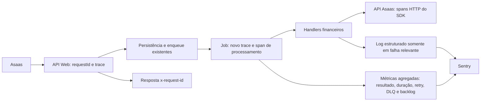

# Observabilidade da Alusa

**Status:** implementação local concluída para os fluxos críticos de Web, Admin, Mobile e financeiro. A ativação efetiva depende de DSNs válidos por runtime; baseline pós-promoção, custo, retenção, dashboards, titulares/substitutos e alertas ainda precisam de confirmação nos provedores.

## Organização do workspace

```text
apps/
  web/
    instrumentation.ts                 # bootstrap Next: Node e Edge
    instrumentation-client.ts          # browser
    lib/observability/                  # adapter Sentry e amostragem
    app/api/observability/web-vitals/   # ingestão curta, limitada e em lote
    src/server/jobs/                   # resumo de execução e métricas de jobs
  admin/
    instrumentation.ts                 # bootstrap separado do Admin
    instrumentation-client.ts
    lib/observability/                  # adapter Sentry do Admin
  mobile/
    src/lib/observability/              # bootstrap Expo/Sentry
    src/lib/api/                        # requestId e propagação de trace
packages/
  observability/                        # contratos, contexto, redaction e port de telemetria
  lib/src/observability/                # adapter de domínio compartilhado, eventos allowlisted
  asaas/src/client/                     # telemetria segura do cliente HTTP/quota/circuit
  database/src/observability/           # eventos de credenciais sem dados de tenant
  finance/src/
    foundation/                         # logger operacional financeiro allowlisted
    webhooks/                           # semântica de fila, retries, duração e DLQ
docs/observability/
```

`packages/observability` não conhece Next.js, Prisma, Sentry ou o domínio financeiro. Cada runtime instala seu adapter. `packages/finance` registra sinais da semântica financeira sem escolher fornecedor. A fonte de verdade financeira continua no banco e nos webhooks/reconciliação; telemetria técnica não é gravada em tabelas.

Os pacotes reutilizáveis usam adapters pequenos (`packages/lib`, `packages/asaas` e `packages/database`) com eventos fechados e campos allowlisted. Os adapters não importam aplicações. O `@alusa/observability` deve ser compilado antes desses pacotes quando o typecheck/build for executado fora do grafo Turbo, que já ordena dependências com `^build`.

## Responsabilidade por sinal

| Sinal | Instrumentação | Destino | Volume |
|---|---|---|---|
| Logs | `createStructuredLog` e APIs/jobs/webhooks migrados | stdout estruturado; avisos e erros importantes também seguem pelo Sentry | sucessos repetitivos filtrados |
| Métricas | `sharedTelemetry.recordMetric` com `counter`, `distribution` ou `gauge` | Sentry Metrics, se inicializado | dimensões allowlisted; sem consulta ou escrita adicional no banco |
| Traces | Next/Sentry e spans explícitos nas fronteiras financeiras | Sentry Performance | padrão de 5% em produção; configurável no Web e Mobile |

Sentry foi mantido porque já era o SDK de erros da Web e do Mobile e a versão instalada no Web oferece APIs de logs e métricas. Não foi instalado um segundo SDK de tracing/OpenTelemetry. Os nomes e atributos usam o vocabulário OpenTelemetry, mantendo o fornecedor atrás de adapters.

## Fluxo de webhook financeiro



O trace de uma execução assíncrona começa no job; não se finge que o worker ainda está dentro do request original. `correlationId` liga a entrega e suas tentativas. O `requestId` identifica cada request técnico e o Sentry mantém `traceId`/`spanId` para cada trace.

## Escopos e acesso

- Métricas globais não carregam `contaId`, `userId`, aluno, responsável, pagamento ou identificadores Asaas como dimensão.
- Leituras operacionais tenant-scoped existentes continuam usando o `contaId` autorizado no servidor; suas amostras não são reexportadas como métrica global.
- `/api/admin/webhooks/metrics/operational` é diagnóstico da instância atual e aceita somente `SUPER_ADMIN`. Não é scrape global e não usa polling para compor totais de produção.
- Cada leitura bem-sucedida desse snapshot gera um registro durável em `SupportAuditLog` com ator, ação, request ID e janela consultada; valores de métricas e chaves de conta não são copiados para a auditoria. Se o registro falhar, a rota não retorna o snapshot. Esse registro excepcional de acesso privilegiado não é persistência da telemetria.
- O snapshot Prometheus local agregado não inclui labels de conta. Em Vercel/serverless, estado em memória representa uma instância e não a plataforma toda.
- Auditoria de segurança e histórico financeiro/acadêmico mantêm armazenamento, autorização e retenção próprios. Não são submetidos a sampling de telemetria.

## Configuração e estado a verificar

| Runtime | Configuração | Código atual |
|---|---|---|
| Web Node/Edge/browser | `SENTRY_DSN` ou `NEXT_PUBLIC_SENTRY_DSN`; taxa `SENTRY_TRACES_SAMPLE_RATE` / `NEXT_PUBLIC_SENTRY_TRACES_SAMPLE_RATE` | Sentry só inicializa quando há DSN e `VERCEL_ENV=production`; default 5%, desenvolvimento 100%; PII padrão desativada |
| Admin Node/Edge/browser | `ADMIN_SENTRY_DSN` e `NEXT_PUBLIC_ADMIN_SENTRY_DSN` | integração independente, default 5%, PII padrão desativada |
| Mobile | `EXPO_PUBLIC_SENTRY_DSN`, `EXPO_PUBLIC_SENTRY_TRACES_SAMPLE_RATE`, `EXPO_PUBLIC_API_URL` | taxa default 5%, propagação limitada ao host de API |
| Métrica de performance amostrada | `OBSERVABILITY_METRIC_SAMPLE_RATE` | default 10%, válida entre 0 e 1 |

Presença de configuração no código não comprova que secrets/DSNs estejam preenchidos, que eventos estejam chegando ou que o custo esteja dentro do limite. Confirmar esses pontos no Sentry e Vercel antes de declarar a cobertura operacional concluída.

Verificação read-only no Vercel em 01/10/2026 às 22:15 UTC: `alusa-web` tem `SENTRY_DSN` e `NEXT_PUBLIC_SENTRY_DSN` configuradas em Production; os valores não foram revelados. `alusa-admin` não tem variáveis com nome `SENTRY` cadastradas, então essa instrumentação ainda não tem DSN confirmado. A validade dos DSNs Web e a chegada de eventos não foram testadas. Mobile usa configuração Expo e não foi verificado pelo painel Vercel.

## Estado do plano

- Contrato compartilhado, adapters Web/Admin, métricas financeiras, request IDs, spans do piloto, handlers de webhook financeiros estruturados e redução do tráfego de Web Vitals foram implementados no workspace.
- Rotas e serviços server-side de API, autenticação, financeiro, matrícula/rematrícula, contratos, integrações, notificações, credenciais e jobs usam eventos estruturados allowlisted; os sinks restantes no código de produção serializam logs estruturados ou são avisos estáticos sem dados de request.
- As interfaces Web críticas removem logs de payload/IDs e enviam falhas por eventos Sentry estáticos com tipo de erro allowlisted e cooldown local de 60 segundos.
- Typechecks/builds e testes focados dos apps/packages alterados passaram. Suites que exigem banco foram executadas somente quando o ambiente confirmou banco de teste; as demais foram interrompidas pelo guard de segurança e não acessaram o banco de desenvolvimento.
- Ainda falta verificar a validade/ingestão dos DSNs Web, provisionar o DSN dedicado do Admin, verificar as variáveis Expo do Mobile, comparar baseline pós-promoção/custo e configurar dashboards/alertas. Os owners organizacionais sugeridos foram aceitos; titulares individuais, substitutos e SLOs calibrados permanecem pendentes.
- O avaliador legado de fila retorna limites heurísticos apenas para diagnóstico; não emite alertas. Até existir baseline, este repositório não declara SLO/limiares de alerta como calibrados.
