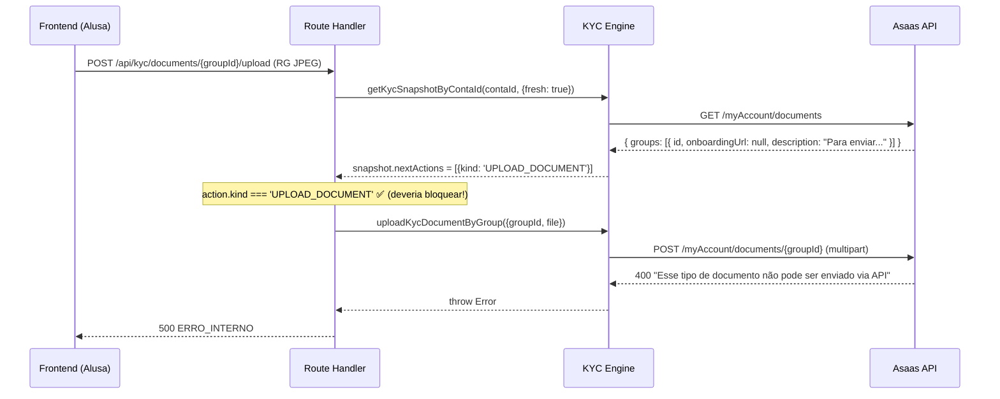

# Plano de Solução — Bug KYC Upload de Documentos

> [!CAUTION]
> **Erro atual**: ao tentar fazer upload de RG (frente/verso, JPEG) via API, o Asaas retorna:
> `"Esse tipo de documento não pode ser enviado via API. Por favor, entre em contato com o suporte."`

---

## 1. Diagnóstico Raiz (Confirmado pela Doc Oficial)

A documentação oficial do Asaas em [Detalhamento do Fluxo de Aprovação de Subcontas](https://docs.asaas.com/docs/detalhamento-do-fluxo-de-aprova%C3%A7%C3%A3o-de-subcontas) separa **dois fluxos distintos**:

### Subconta Padrão (não-BaaS)
```
Criação → E-mail de senha → Login na interface Asaas → Envio via interface Asaas
```
- O usuário envia documentos **diretamente na interface do Asaas**
- **NÃO aceita** envio de documentos via API (`POST /myAccount/documents/{id}`)
- `onboardingUrl` retorna `null` porque não existe link de onboarding externo

### Subconta BaaS (White Label)
```
Criação → GET /myAccount/documents → Verificar onboardingUrl → Enviar conforme método
```
- Se `onboardingUrl` **presente** → enviar pelo link externo (redirect)
- Se `onboardingUrl` **ausente** → enviar via API (`POST /myAccount/documents/{id}`)

> [!IMPORTANT]
> **O atributo `onboardingUrl` determina obrigatoriamente o método de envio do documento.**
> - Nunca tente enviar via API um documento que possui `onboardingUrl` → será rejeitado.
> - A ausência de `onboardingUrl` **só significa "API liberada"** em subcontas **BaaS**.
> - Em subcontas **padrão**, `onboardingUrl` é `null` porque o envio é pela interface Asaas, não pela API.

> [!WARNING]
> O formato White Label/BaaS precisa estar **previamente alinhado e implantado** pelo gerente de contas Asaas.
> Criar subcontas via API **sem essa definição prévia** resulta em subcontas **fora da estrutura BaaS/White Label**.

---

## 2. O Bug no Código da Alusa

### Localização exata

O problema está na função [deriveNextActions](file:///Users/blendstudio/Projects/alusa/packages/finance/src/use-cases/kyc/get-kyc-snapshot.ts#137-225) em [get-kyc-snapshot.ts](file:///Users/blendstudio/Projects/alusa/packages/finance/src/use-cases/kyc/get-kyc-snapshot.ts#L207-L220):

```typescript
// Cenário B: onboardingUrl = null + NOT_SENT/REJECTED
if (!hasOnboarding && ACTIONABLE_STATUSES.has(groupStatus)) {
  actions.push({
    kind: 'UPLOAD_DOCUMENT',  // ← AQUI ESTÁ O BUG
    // ...
  });
}
```

**A lógica binária falsa**: o código assume que se não há `onboardingUrl`, então o upload via API é permitido. Mas para **subcontas padrão**, o `onboardingUrl` é `null` porque o envio é pela interface do Asaas.

### Arquivos afetados

| Arquivo | Linha | Problema |
|---------|-------|---------|
| [get-kyc-snapshot.ts](file:///Users/blendstudio/Projects/alusa/packages/finance/src/use-cases/kyc/get-kyc-snapshot.ts#L207-L220) | L207-220 | Cenário B assume `!onboardingUrl` = `UPLOAD_DOCUMENT` |
| [get-kyc-snapshot.ts](file:///Users/blendstudio/Projects/alusa/packages/finance/src/use-cases/kyc/get-kyc-snapshot.ts#L294-L320) | L294-320 | Cache path replica a mesma lógica errada |
| [get-kyc-view-model.ts](file:///Users/blendstudio/Projects/alusa/packages/finance/src/use-cases/kyc/get-kyc-view-model.ts#L135) | L135 | `method = group.onboardingUrl ? 'EXTERNAL' : 'INTERNAL'` — mesma suposição |
| [upload-kyc-document-by-group.ts](file:///Users/blendstudio/Projects/alusa/packages/finance/src/use-cases/kyc/upload-kyc-document-by-group.ts#L98-L100) | L98-100 | Só bloqueia se `onboardingUrl` presente; não bloqueia subconta padrão |
| [kyc-snapshot.dto.ts](file:///Users/blendstudio/Projects/alusa/packages/finance/src/dtos/kyc/kyc-snapshot.dto.ts#L197-L199) | L197-199 | Já filtra a description template, mas não usa esse sinal para bloquear upload |

### Fluxo do erro



---

## 3. Plano de Correção (5 etapas)

### Etapa 1 — Determinar o tipo da subconta (BaaS vs Padrão)

**Objetivo**: Saber se a subconta é BaaS ou Padrão antes de decidir o método de envio.

**Opção A — Consultar via description do Asaas** (rápido, sem mudança de schema)

O Asaas já nos diz quando o upload via API não é suportado. A description `"Para enviar esse documento acesse nosso aplicativo ou utilize o link de onboarding."` é um **sinal explícito** de que o grupo não aceita upload via API.

Ao invés de filtrar essa description (como já fazemos em `ASAAS_TEMPLATE_DESCRIPTIONS`), devemos **usá-la como regra de negócio**:

```typescript
// Novo kind: o documento precisa ser enviado pela interface Asaas (subconta padrão)
const ASAAS_INTERFACE_ONLY_INDICATORS = new Set([
  'Para enviar esse documento acesse nosso aplicativo ou utilize o link de onboarding.',
]);

function isAsaasInterfaceOnly(group: AsaasMyAccountDocumentGroup): boolean {
  return ASAAS_INTERFACE_ONLY_INDICATORS.has(group.description?.trim() ?? '');
}
```

**Opção B — Flag persistida** (mais robusto, requer migration)

Adicionar `subAccountType: 'STANDARD' | 'BAAS'` na tabela [AsaasAccount](file:///Users/blendstudio/Projects/alusa/packages/asaas/src/types/asaas.ts#175-180). Determinar o tipo no momento da criação da subconta (via resposta do Asaas ou configuração do tenant) e persistir.

> [!TIP]
> **Recomendação**: Implementar **Opção A como correção imediata** e **Opção B como evolução** para não depender de heurísticas de texto.

---

### Etapa 2 — Novo [KycNextActionKind](file:///Users/blendstudio/Projects/alusa/packages/finance/src/dtos/kyc/kyc-snapshot.dto.ts#8-13): `ASAAS_INTERFACE_REQUIRED`

Adicionar um novo kind no DTO que representa "envio só pela interface Asaas":

**Arquivo**: [kyc-snapshot.dto.ts](file:///Users/blendstudio/Projects/alusa/packages/finance/src/dtos/kyc/kyc-snapshot.dto.ts)

```diff
 export type KycNextActionKind =
   | 'EXTERNAL_ONBOARDING'
   | 'UPLOAD_DOCUMENT'
   | 'WAITING_PROVIDER'
-  | 'PROVISIONING_TIMEOUT';
+  | 'PROVISIONING_TIMEOUT'
+  | 'ASAAS_INTERFACE_REQUIRED';
```

```diff
 export type VerificationActionMode =
   | 'REDIRECT'
   | 'UPLOAD'
   | 'WAITING_PROVIDER'
-  | 'PROVISIONING_TIMEOUT';
+  | 'PROVISIONING_TIMEOUT'
+  | 'ASAAS_INTERFACE_REQUIRED';
```

---

### Etapa 3 — Corrigir [deriveNextActions](file:///Users/blendstudio/Projects/alusa/packages/finance/src/use-cases/kyc/get-kyc-snapshot.ts#137-225) no KYC Engine

**Arquivo**: [get-kyc-snapshot.ts](file:///Users/blendstudio/Projects/alusa/packages/finance/src/use-cases/kyc/get-kyc-snapshot.ts)

```diff
     // Cenário B: onboardingUrl = null + NOT_SENT/REJECTED
     if (!hasOnboarding && ACTIONABLE_STATUSES.has(groupStatus)) {
+      // Subconta padrão: Asaas marca via description que o upload via API não é permitido
+      if (isAsaasInterfaceOnly(group)) {
+        actions.push({
+          kind: 'ASAAS_INTERFACE_REQUIRED',
+          groupId: group.id,
+          groupStatus,
+          type: groupType,
+          title: group.title ?? 'Verificação via interface Asaas',
+          description: 'Esse documento deve ser enviado diretamente na interface do Asaas.',
+          responsible: responsibleMeta,
+        });
+        continue;
+      }
+
       actions.push({
         kind: 'UPLOAD_DOCUMENT',
         // ... (mantém como está para subcontas BaaS reais)
       });
     }
```

Aplicar a mesma lógica no path de cache ([buildSnapshotFromCache](file:///Users/blendstudio/Projects/alusa/packages/finance/src/use-cases/kyc/get-kyc-snapshot.ts#259-346)).

---

### Etapa 4 — Corrigir guard no upload use-case

**Arquivo**: [upload-kyc-document-by-group.ts](file:///Users/blendstudio/Projects/alusa/packages/finance/src/use-cases/kyc/upload-kyc-document-by-group.ts)

```diff
   if (group.onboardingUrl) {
     throw new OnboardingUrlRequiredError({ onboardingUrl: group.onboardingUrl });
   }

+  // Guard: subcontas padrão não permitem upload via API
+  if (isAsaasInterfaceOnly(group)) {
+    throw new Error(
+      'Este documento deve ser enviado pela interface do Asaas. O upload via API não é permitido para esse tipo de subconta.'
+    );
+  }
```

---

### Etapa 5 — Adaptar o Frontend

**5a. Route handler** — [route.ts](file:///Users/blendstudio/Projects/alusa/apps/web/app/api/kyc/documents/%5BgroupId%5D/upload/route.ts)

Adicionar check para `ASAAS_INTERFACE_REQUIRED` junto com `EXTERNAL_ONBOARDING`:

```diff
     if (action?.kind === 'EXTERNAL_ONBOARDING') {
       return json(409, { 
         code: 'EXTERNAL_REQUIRED', 
         message: 'Este documento deve ser enviado pelo fluxo externo.',
       });
     }

+    if (action?.kind === 'ASAAS_INTERFACE_REQUIRED') {
+      return json(409, { 
+        code: 'ASAAS_INTERFACE_REQUIRED',
+        message: 'Este documento deve ser enviado diretamente na interface do Asaas.',
+      });
+    }
```

**5b. KycStatusArea / KycActionCard** — Exibir instrução ao invés do botão de upload

Quando `action.mode === 'ASAAS_INTERFACE_REQUIRED'`:
- **Não exibir** botão de upload
- **Exibir** mensagem informativa com link para o painel Asaas (se disponível)
- Orientar o usuário a acessar a interface do Asaas para enviar documentos

**5c. KycUploadModal** — Bloquear abertura

```diff
   if (!action) return null;
   if (action.mode === 'REDIRECT') return null;
+  if (action.mode === 'ASAAS_INTERFACE_REQUIRED') return null;
   if (!uploadGroupId) return null;
```

---

## 4. Plano de teste de validação

### Testes unitários

| Cenário | Input mock | Expected |
|---------|------------|----------|
| Subconta BaaS, `onboardingUrl: null`, sem description template | → | `UPLOAD_DOCUMENT` ✅ |
| Subconta BaaS, `onboardingUrl: "https://..."` | → | `EXTERNAL_ONBOARDING` ✅ |
| Subconta Padrão, `onboardingUrl: null`, description = template | → | `ASAAS_INTERFACE_REQUIRED` ✅ |
| Upload de arquivo para grupo `ASAAS_INTERFACE_REQUIRED` | → | `throw Error` ✅ |

### Teste manual / integração

1. Criar subconta padrão via API Asaas
2. Aguardar 15s, consultar `GET /myAccount/documents`
3. Verificar que o grupo IDENTIFICATION retorna `onboardingUrl: null` + description template
4. Confirmar que a UI exibe mensagem informativa (não botão upload)
5. Verificar que POST direto no endpoint é bloqueado com erro 409

---

## 5. Ação de Infraestrutura Recomendada

> [!IMPORTANT]
> **Se a Alusa precisa que o upload de documentos seja feito via API** (para ter controle total do fluxo na UI), é necessário:
> 1. **Contatar o gerente de contas Asaas** para ativar o formato **White Label/BaaS**
> 2. Isso fará com que o Asaas retorne `onboardingUrl` nos documentos que precisam de envio externo
> 3. E **aceite** `POST /myAccount/documents/{id}` nos documentos que devem ser enviados via API
> 
> Sem isso, subcontas criadas via `POST /accounts` continuarão sendo tratadas como subcontas padrão pelo Asaas.

---

## 6. Resumo das Alterações

| # | Arquivo | Tipo | Descrição |
|---|---------|------|-----------|
| 1 | [kyc-snapshot.dto.ts](file:///Users/blendstudio/Projects/alusa/packages/finance/src/dtos/kyc/kyc-snapshot.dto.ts) | Type | Adicionar `ASAAS_INTERFACE_REQUIRED` aos kinds |
| 2 | [get-kyc-snapshot.ts](file:///Users/blendstudio/Projects/alusa/packages/finance/src/use-cases/kyc/get-kyc-snapshot.ts) | Logic | Detectar subconta padrão pela description |
| 3 | [get-kyc-snapshot.ts](file:///Users/blendstudio/Projects/alusa/packages/finance/src/use-cases/kyc/get-kyc-snapshot.ts) (cache) | Logic | Mesma correção no path de cache |
| 4 | [upload-kyc-document-by-group.ts](file:///Users/blendstudio/Projects/alusa/packages/finance/src/use-cases/kyc/upload-kyc-document-by-group.ts) | Guard | Bloquear upload para subcontas padrão |
| 5 | [route.ts](file:///Users/blendstudio/Projects/alusa/apps/web/app/api/kyc/route.ts) (upload) | API | Retornar 409 com código específico |
| 6 | [KycUploadModal.tsx](file:///Users/blendstudio/Projects/alusa/apps/web/features/kyc/components/KycUploadModal.tsx) | UI | Não abrir modal para esse kind |
| 7 | [KycActionCard.tsx](file:///Users/blendstudio/Projects/alusa/apps/web/features/kyc/components/KycActionCard.tsx) / [KycStatusArea.tsx](file:///Users/blendstudio/Projects/alusa/apps/web/features/kyc/components/KycStatusArea.tsx) | UI | Exibir instrução ao invés de botão upload |
| 8 | [kyc-cache-utils.ts](file:///Users/blendstudio/Projects/alusa/packages/finance/src/use-cases/kyc/kyc-cache-utils.ts) | Cache | Persistir `isInterfaceOnly` flag no cache v2 |

---

## 7. Referências Oficiais Consultadas

| Documento | URL |
|-----------|-----|
| Detalhamento do Fluxo de Aprovação de Subcontas | [Link](https://docs.asaas.com/docs/detalhamento-do-fluxo-de-aprova%C3%A7%C3%A3o-de-subcontas) |
| Onboarding e envio de documentos via link | [Link](https://docs.asaas.com/docs/onboarding-e-envio-de-documentos-via-link) |
| Verificar documentos pendentes (API Reference) | [Link](https://docs.asaas.com/reference/verificar-documentos-pendentes) |
| Enviar documentos (API Reference) | [Link](https://docs.asaas.com/reference/enviar-documentos) |
