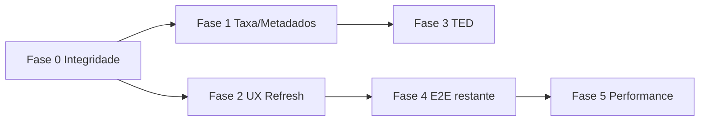

# Plano de melhorias — Meu Dinheiro / Transferências (Pix e TED)

> Baseado em E2E DevTools (sessões 1–3, 2026-06-18), ADR [`docs/adr-transfer-asaas-alignment.md`](../adr-transfer-asaas-alignment.md), observações [`docs/runbooks/finance-transfer-e2e-observations.md`](../runbooks/finance-transfer-e2e-observations.md) e documentação oficial Asaas (MCP + OpenAPI `POST /v3/transfers`).

## Objetivo

Eliminar bugs P1–P19, alinhar regras de negócio ao Asaas e entregar UX em **português claro** para operadores de escola (não expor enums técnicos como `PHONE`, `EVP`, `EMAIL` na interface).

---

## Referência Asaas (regras que a Alusa deve espelhar)

| Tema | Regra oficial | Fonte |
|------|---------------|-------|
| Pix por chave | `pixAddressKey` + `pixAddressKeyType` (`CPF`, `CNPJ`, `E-mail`, `Telefone`, `Chave aleatória`) | OpenAPI `TransferSaveRequestPixAddressKeyType` |
| Normalização Pix | CPF/CNPJ **sem pontuação**; telefone **11 dígitos** (DDD + número), ex.: `47999999999` | [Guia Pix/TED](https://docs.asaas.com/docs/transferencia-para-contas-de-outra-instituicao-pix-ted) |
| Conta bancária | Omitir `operationType` → Asaas escolhe Pix (se banco participa) ou TED | Guia + ADR D1 |
| `ownerBirthDate` | Obrigatório quando titular PF **CPF ≠ CPF/CNPJ** da conta Asaas | OpenAPI `TransferBankAccountSaveRequestDTO` |
| Taxa | Resposta traz `transferFee` e `netValue`; estimativa prévia via taxas da conta | OpenAPI `TransferGetResponseDTO` |
| Cancelamento | `DELETE /v3/transfers/{id}/cancel`; status `PENDING` / `canBeCancelled` | OpenAPI |
| Estados terminais | `DONE`, `CANCELLED`, `FAILED` | OpenAPI enum |
| Webhooks | `TRANSFER_*` como fonte de mudança de estado | ADR + runbook |

**Termos na UI (mapeamento técnico → usuário):**

| Asaas (API) | UI Alusa |
|-------------|----------|
| `PIX` | Pix |
| `TED` | TED |
| `CPF` | CPF |
| `CNPJ` | CNPJ |
| `EMAIL` | E-mail |
| `PHONE` | Telefone |
| `EVP` | Chave aleatória (Pix) |

---

## Matriz de bugs → correção

| ID | Problema | Causa raiz | Correção |
|----|----------|------------|----------|
| **P1** | Taxa R$ 0,00 na listagem/detalhe | `feeValue` do banco 0 quando Asaas não popula `transferFee`; fallback só estimativa no wizard | Persistir taxa estimada até webhook/GET; exibir `feeValue ?? estimatedFee`; fallback em `transfer-metadata.ts` |
| **P2** | “Pix” quando usuário escolheu bancária | Asaas resolve modalidade (correto) | Exibir **“Pix (via conta bancária)”** ou tooltip: *“Você informou dados bancários; o Asaas liquidou via Pix.”* Usar `resolvedOperation` + flag `requestedViaBankForm` |
| **P3** | Listagem `Banco 001` vs detalhe nome completo | Enriquecimento só no detalhe | Reutilizar `resolveBankDisplayName` na listagem (`list-transfers.ts` / mapper) |
| **P4/P6** | Órfãos “Solicitada” após erro 400 | `transferRequest.create` **antes** do POST Asaas; `catch` não reverte | **Opção A (preferida):** criar registro só após sucesso Asaas. **Opção B:** marcar `FAILED`/`CANCELED` + `failReason` no catch; não listar como pendência operacional |
| **P5** | TED sandbox falha PSP | Esperado | Manter runbook; copy na UI quando `FAILED` + mensagem PSP |
| **P7** | Copy cancelamento fala de matrícula | Template genérico errado | Texto dedicado: *“A transferência será cancelada na Alusa e no Asaas (quando aplicável). O saldo não será debitado.”* |
| **P8/P12** | UI não reflete cancel/conclusão | Cache SWR/query sem invalidação; realtime lag | Após mutação: `invalidateQueries(['transfers'])` + atualizar detalhe; otimistic update no cancel |
| **P9** | Valor “10” → R$ 0,10 | Máscara centavos | Hint *“Digite os centavos ou use vírgula (ex.: 10,00)”*; validar mínimo R$ 0,01 no blur |
| **P10** | Débito saldo ≠ estimativa | Sandbox assimétrico + fee 0 no GET | Documentar; exibir aviso *“Taxa confirmada após processamento”*; reconciliar saldo via extrato |
| **P11** | Linhas canceladas/órfãs vazias | Sem metadados Asaas | Status `Falha na validação` / ocultar órfãos `FAILED` sem Asaas; coluna destino = chave mascarada local |
| **P13** | Modal senha aberto após 400 | Handler de erro não fecha dialog | `onError`: fechar senha + manter wizard; toast com erro mapeado |
| **P14** | CPF 11 dígitos → Telefone | `isValidPhone` aceita sequências que falham CPF BACEN | Se dígitos = 11: priorizar CPF se checksum válido **ou** se usuário digitou máscara CPF; se ambíguo, **seletor manual** “Tipo da chave” |
| **P15** | Duplo clique → 2 órfãos | Sem debounce; idempotency key nova por clique | Botão `disabled` + `isSubmitting`; reutilizar `idempotencyKey` da sessão do wizard até sucesso/erro terminal |
| **P16** | “Ver comprovante” com `href="#"` | Link renderizado sem URL | Renderizar só se `transactionReceiptUrl`; senão texto “Indisponível” sem link |
| **P17** | Hint “Chave reconhecida como EMAIL” | Usa enum cru | Usar `formatPixKeyType()` → “E-mail”, “Telefone”, etc. |
| **P18** | Busca “Joao” não filtra | Filtro client-side incompleto ou debounce | Filtrar por `recipientName`, documento mascarado e chave; debounce 300ms |
| **P19** | Polling realtime agressivo | Intervalo fixo curto | Backoff + `document.visibilityState` + pausar fora de `/financeiro/conta` |

---

## Plano de implementação (fases)

### Fase 0 — Correções críticas (integridade e confiança)

**Escopo:** P6, P15, P13, P14 (parcial), P7, P16

1. **`request-withdraw.ts`**
   - Mover `prisma.transferRequest.create` para **depois** de sucesso do `createPixTransfer` / `createBankTransfer`, **ou**
   - No `catch`: `update` → status `FAILED`, `failReason` mapeado, `asaasTransferId: null`; audit `finance.transfer.request_failed`.
   - Não retornar 200 ao client com registro `REQUESTED` quando Asaas falhou.

2. **API route + wizard**
   - Gerar `idempotencyKey` ao abrir wizard (UUID) e reenviar até conclusão.
   - `Confirmar e solicitar`: `disabled` enquanto `isPending`; ignorar cliques duplicados.

3. **`transfer-wizards.tsx`**
   - Fechar dialog senha em erro; mapear `PIX_KEY_NAO_ENCONTRADA` etc.

4. **`ContaTransferDetailPage.tsx`**
   - Copy cancelamento específica de transferência.
   - Comprovante: link condicional.

5. **Detecção de chave Pix**
   - Extrair `detectPixKeyType` para `@alusa/finance/client` (mesma regra UI + backend).
   - Ambiguidade 11 dígitos: dropdown “Tipo da chave” (CPF / Telefone) quando ambos válidos.
   - Hint com `formatPixKeyType` em português.

**Testes:** estender `request-withdraw.test.ts` (rollback/failed); teste adversarial duplo POST; unit `detectPixKeyType` com casos BACEN.

**Critério de aceite:** erro 400 **não** gera linha “Solicitada” na listagem; duplo clique = 1 registro.

---

### Fase 1 — Taxa, saldo e metadados financeiros

**Escopo:** P1, P10, P3, P11

1. **`transfer-metadata.ts` / webhooks**
   - Prioridade exibição taxa: `transferFee` Asaas → `feeValue` local → `estimateTransferFee(fees, operation)`.
   - Gravar estimativa em `feeValue` no create se Asaas retornar 0/null.

2. **Listagem (`list-transfers.ts`, `ContaPage.tsx`)**
   - Nome do banco enriquecido (mesmo helper do detalhe).
   - Órfãos/falhas: situação **“Não enviada”** ou **“Falha na validação”**; destino = chave mascarada do `destination` JSON.

3. **Wizard**
   - Resumo: *“Total estimado (valor + taxa). Valor final confirmado pelo Asaas.”*

**Testes:** `list-transfers.test.ts`, `get-transfer-detail.test.ts` com fee fallback.

---

### Fase 2 — UX pós-ação e modalidade resolvida

**Escopo:** P2, P8, P12, P17

1. **Invalidação de cache**
   - `ContaTransferDetailPage`: após cancel, `router.refresh()` + mutate SWR/React Query.
   - `ContaPage`: escutar evento realtime `transfer.updated` e patch na linha.

2. **Operação exibida**
   - Label: `formatResolvedOperation(requestedType, resolvedOperation)` → ex. *“Pix (liquidado automaticamente)”* quando formulário foi bancário.

3. **Copy em português**
   - Revisar todos os enums visíveis no wizard e detalhe.
   - `formatPixKeyType`: “Aleatoria” → **“Chave aleatória (Pix)”**.

**Testes:** teste de componente cancel refresh; snapshot wizard hints PT.

---

### Fase 3 — TED alinhado ao Asaas

**Escopo:** P5, `ownerBirthDate` E2E, ADR D1/D2

1. **Confirmar** `buildBankTransferAsaasPayload` **omite** `operationType` (já ADR).
2. **UI TED**
   - Campo data nascimento (já existe) — validar submit E2E com CPF terceiro + `1990-01-01`.
   - Mensagem sandbox quando `FAILED`: orientar painel Asaas (runbook).

3. **Backend**
   - Erro Asaas por falta de `ownerBirthDate` → mensagem clara antes do POST (já bloqueado).

**Testes E2E:** TED PF terceiro com data → PENDING ou FAILED sandbox (aceitável).

---

### Fase 4 — Cobertura funcional restante

| Cenário | Status E2E | Ação |
|---------|------------|------|
| Pix E-mail BACEN a00001/a00004 | ✅ | Manter regressão automatizada |
| Pix CPF válido sandbox | Pendente | Obter CPF BACEN registrado; teste regressão |
| Pix Telefone 11 dígitos / +55 | ✅ detecção | Submit com chave sandbox real |
| Pix Chave aleatória inválida | ✅ | Regressão pós-Fase 0 |
| TED CNPJ próprio (mesmo tenant) | ✅ parcial | Sem `ownerBirthDate` |
| TED PF terceiro sem data | ✅ bloqueio UI | Regressão |
| TED PF terceiro com data | Pendente submit | Fase 3 |
| Cancelamento Asaas (`canBeCancelled`) | ✅ órfão local | Cancel remoto com transfer real PENDING |
| Saldo insuficiente (valor + taxa) | Coberto unit | E2E wizard R$ 500 com saldo R$ 190 |
| Agendamento (`scheduleDate`) | Não testado | Teste + copy “Agendada para” |
| Busca / filtros / export | Parcial | P18 + smoke export |
| Idempotência payload conflict | Unit | Manter |

---

### Fase 5 — Performance e acessibilidade

**Escopo:** P19, issues DevTools

1. Realtime: intervalo 15–30s, pause hidden tab.
2. Formulários wizard: `id`/`name`, labels, username oculto no modal senha.

---

## Ordem de prioridade sugerida

| Prioridade | Fase | Risco se não fizer |
|------------|------|---------------------|
| P0 | Fase 0 | Operador perde confiança (fantasmas, duplicatas) |
| P1 | Fase 1 | Divergência financeira percebida (taxa/saldo) |
| P2 | Fase 2 | Fricção operacional (reload manual) |
| P3 | Fase 3–4 | TED terceiro falha silenciosa |
| P4 | Fase 5 | Custo infra / a11y |

---

## Arquivos principais a tocar

| Área | Arquivos |
|------|----------|
| Core | `packages/finance/src/use-cases/request-withdraw.ts`, `cancel-transfer.ts`, `list-transfers.ts`, `transfers/asaas-transfer-payload.ts`, `transfers/transfer-metadata.ts` |
| Webhooks | `packages/finance/src/webhooks/transfer-webhook-handler.ts` |
| UI | `apps/web/features/financeiro/conta/transfer-wizards.tsx`, `ContaPage.tsx`, `ContaTransferDetailPage.tsx` |
| API | `apps/web/app/api/finance/transfers/**` |
| Testes | `request-withdraw.test.ts`, `list-transfers.test.ts`, E2E Playwright (novo spec transferências) |
| Docs | Atualizar runbook sandbox + ADR se mudar ordem create |

---

## Critérios de “pronto para produção”

- [ ] Nenhum `TransferRequest` `REQUESTED` com `asaasTransferId: null` após erro 400/422.
- [ ] Taxa exibida coerente com extrato (ou label “estimada” vs “confirmada”).
- [ ] Cancelamento atualiza UI sem reload; copy correta.
- [ ] Chaves Pix: tipos em português; ambiguidade CPF/Telefone resolvida.
- [ ] TED terceiro PF exige data nascimento (UI + backend + Asaas).
- [ ] Modalidade resolvida explicada quando diferente do formulário.
- [ ] Testes unitários + E2E cobrindo matriz Fase 4.
- [ ] Runbook operacional atualizado.

---

## Sessão 3 — testes adicionais (2026-06-18)

| Cenário | Resultado |
|---------|-----------|
| Cancelar órfãos EVP (2×) | ✅ Cancelamento **local** (`finance.transfer.canceled.locally`); listagem **Cancelada**; P7 copy ainda errada |
| Órfão cancelado | ⚠️ Link “Ver comprovante” fantasma (P16) |
| Busca “Joao” | ⚠️ Não filtrou linhas irrelevantes de forma clara (P18) |
| Hint tipo de chave | ⚠️ Exibe enum inglês `EMAIL`/`PHONE` (P17) |

**Saldo final sessão 3:** R$ 190,54 (sem novos débitos).
